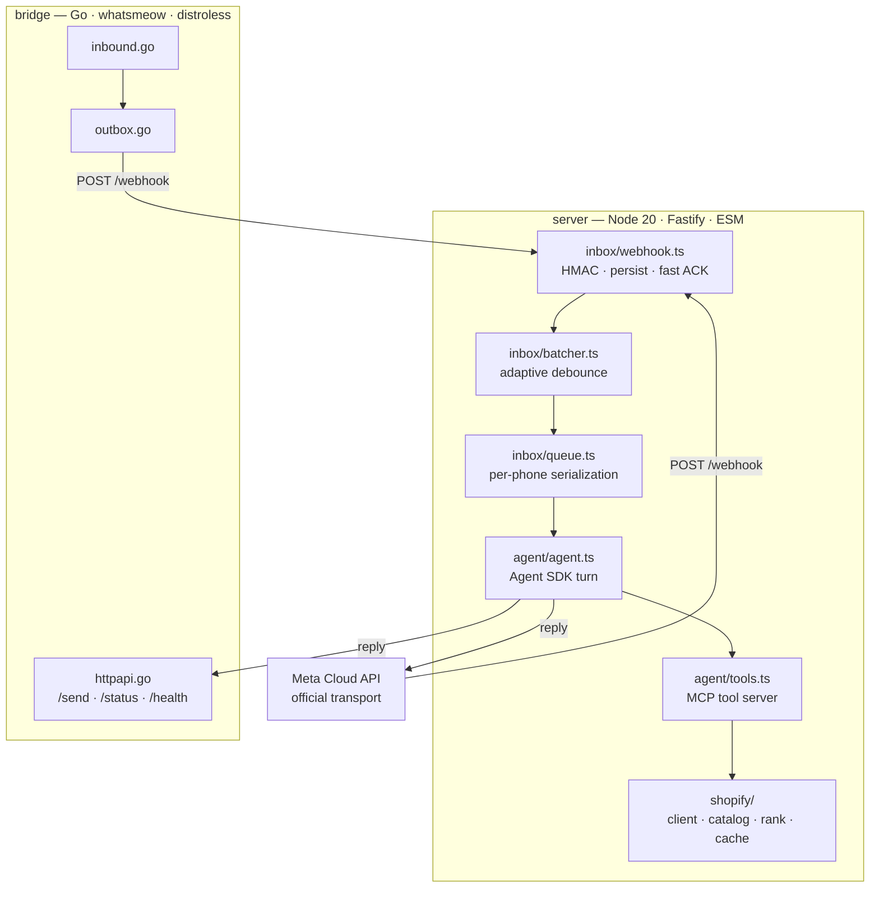
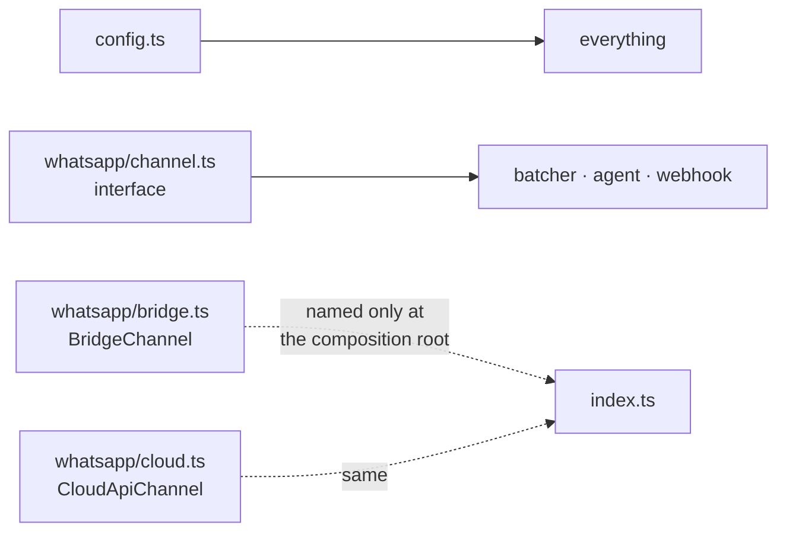

# 01 · Architecture

> ℹ️ **Two transports, one seam.** `WHATSAPP_PROVIDER` decides which one runs and both
> implement `WhatsAppChannel`. Only `index.ts` ever names either.
> `server/src/index.ts:46`

| Process | Runtime | Port | Published | Loses on volume loss |
|---|---|---|---|---|
| `server` | Node 20, Fastify | 3001 | yes (webhook + `/media/*`) | inbox, sessions, leads, photos |
| `bridge` | Go static binary | 3002 | **never** | the WhatsApp pairing itself |

> ⚠️ The bridge is deliberately unpublished — no `ports:`, no Coolify domain.
> Anyone who can reach `/send` can send WhatsApp messages as the business.
> `compose.yaml:141`

## Pages

| Page | Contents |
|---|---|
| [`pipeline-mensajes.md`](pipeline-mensajes.md) | Webhook → batcher → queue → agent, and why each stage exists |
| [`capa-shopify.md`](capa-shopify.md) | The four modules of `shopify/`, and the two 200-OK failure shapes |
| [`agente-y-sesiones.md`](agente-y-sesiones.md) | The Agent SDK turn, the role boundary, session lifetime |
| [`bridge-whatsapp.md`](bridge-whatsapp.md) | The linked-device transport, the outbox, LID resolution |
| [`cloud-api-whatsapp.md`](cloud-api-whatsapp.md) | Meta's official transport, the deferred media fetch, the 24h window |
| [`despliegue.md`](despliegue.md) | Images, volumes, secrets, health, and what a restart cannot fix |

## Dependency rules

| Rule | Why |
|---|---|
| ESM with explicit `.js` extensions | `server/tsconfig.build.json` sets `rootDir: "src"` |
| No barrel files | Every import names the module it actually needs |
| `config.ts` stays at `src/` root | It computes `REPO_ROOT` with a hardcoded `../../`, `server/src/config.ts:7` |
| Only `index.ts` names a channel implementation | Everything else takes `WhatsAppChannel`, `server/src/whatsapp/channel.ts:15` |
| The webhook never downloads a file | It stores a reference; the worker fetches, `server/src/inbox/batcher.ts:316` |
| Tools never send a message | The turn's single reply is `runAgentTurn`'s, `server/src/agent/tools.ts:34` |

> ℹ️ `WhatsAppChannel` earned its place twice over. It is what lets the whole pipeline be
> tested with a plain object — no HTTP client, no paired device, no casts — and it is why
> adding Meta's official transport was a second implementation rather than a rewrite.

## Entry points referenced outside the code

| Path | Referenced by |
|---|---|
| `server/dist/index.js` | image `CMD` |
| `server/dist/data/backup.js` | `compose.yaml:194`, `server/package.json` |
| `server/dist/data/purge-sessions.js` | `compose.yaml:218`, `server/package.json` |
| `/bridge -healthcheck` | `compose.yaml:167`, `bridge/main.go:157` |

> ⚠️ Moving an entry point means updating `compose.yaml` and `package.json` too.
> Nothing type-checks these; they fail at runtime, in production.

Verified against `36e95b2` — 2026-08-25
