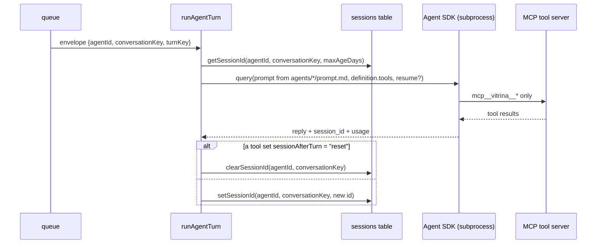
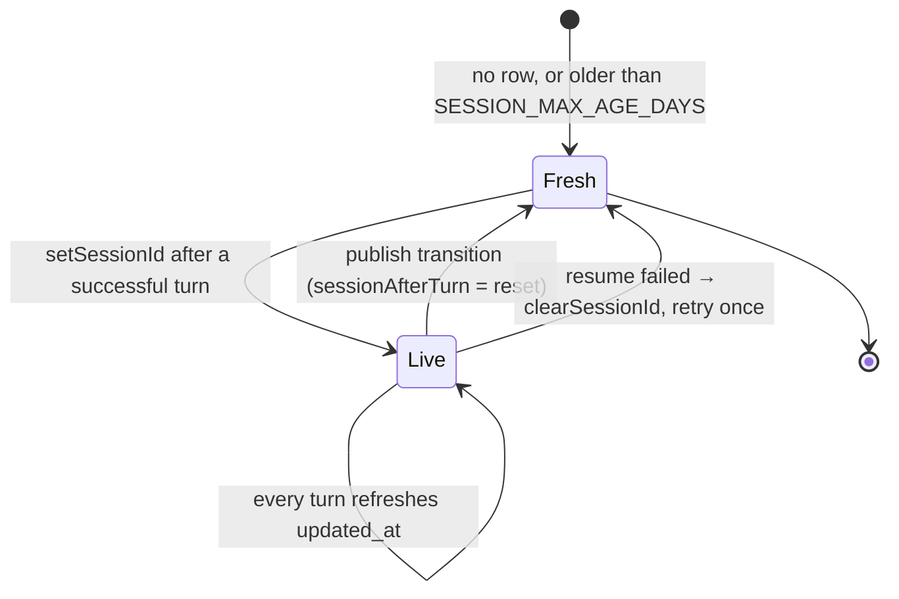

# The agent and its sessions

## The role boundary, enforced twice

| Layer | Mechanism | Location | Pinned by |
|---|---|---|---|
| Tools | Each agent declares its tool set in `agent.yaml` | `agents/vitrina-{ventas,inventario}/agent.yaml` | `test/tools.test.ts` |
| Persona | Each agent reads its own prompt from disk | `agents/vitrina-{ventas,inventario}/prompt.md` | `test/prompt.test.ts` |

| Role | Tools |
|---|---|
| Customer | `search_catalog`, `get_product`, `save_lead`, `build_cart` |
| Owner | those four **plus** `list_products`, `create_product`, `update_product`, `add_variant`, `delete_product`, `get_inventory`, `adjust_inventory`, `attach_pending_photos`, `list_locations`, `list_leads` |

> ⚠️ `get_product` is now **two registry entries** (`get_product` and `get_product_any_status`),
> both exposed to the model as `get_product`. The customer's returns "no product found" 
> for a non-`ACTIVE` product: confirming that a hidden product exists is itself a leak.
> `server/src/tools/registry.ts:52-54`

> ℹ️ Giving the customer's tool a `status` parameter instead would move that boundary
> out of the tool set — where it is structural — into a value the model decides.

## The built-ins are REMOVED, not denied

| Option | What it actually does |
|---|---|
| `tools: []` | **Removes** every built-in from the model's context. The only real restriction |
| `allowedTools` | Auto-approves ours. Does NOT restrict — the SDK says use `tools` for that |
| `canUseTool` | Denies at EXECUTION, when a turn is already spent. Defence in depth, and the tool log |

`server/src/agent/runtime.ts:95-99` — the tool server is built with exactly `definition.tools`

> ⚠️ Denying from `canUseTool` alone is too late. The model still SEES `Bash`, picks it,
> and burns a turn discovering it is refused — then picks it again. Observed against a real
> store: **twelve turns, every one a denied `Bash` call, no answer, 52 seconds.**

> ℹ️ `allowedTools` still carries our own tools, or each would wait on a prompt that
> nothing in this process can answer.

## Session lifetime

| Fact | Detail |
|---|---|
| Where the id lives | SQLite `sessions(agent_id, conversation_key)` (composite key), on the `vitrina-data` volume |
| Where the transcript lives | The SDK's home dir, on the `vitrina-sessions` volume |
| Expiry | `SESSION_MAX_AGE_DAYS` of **silence** — a sliding window |
| Context growth | Bounded by the SDK's own auto-compaction. Do **not** build a compaction layer |

> ⚠️ The two stores can diverge. A container whose home is ephemeral resumes an id whose
> transcript is gone, and the subprocess exits 1. `runAgentTurn` retries once with a
> fresh session — but **only when a resume was in play**. `server/src/agent/runtime.ts:407-413`

> ℹ️ The retry is gated on `resumeId`, not on the error text: the SDK reports every
> failure as a generic "exited with code 1", so matching the wording buys no precision
> and would silently stop working if it changed.

## Session reset on publish

`ctx.sessionAfterTurn = "reset"` is set by `create_product` and `update_product` when a
product actually transitions to `ACTIVE`, and applied **after** the turn.
`server/src/tools/packs/catalog.ts`, `server/src/agent/runtime.ts`

`session.resetOn` is declared in the definition but not read by the runtime.

> ⚠️ A mid-turn `clearSessionId` would be clobbered by the post-turn persist. The mutable
> `TurnContext` is the **only** in-process channel from a tool back to `runAgentTurn`.

Because history may be cleared before the next message, the owner prompt requires every
confirmation to name the product's handle or SKU — the message is the owner's only
durable reference. `agents/vitrina-inventario/prompt.md`

## Provider is a set of environment variables

`buildAgentEnv` writes every knob it owns, **including to `undefined`**, then deletes the
undefined keys. `server/src/agent/runtime.ts:77-117`

> ⚠️ A conditional spread would leave whatever the shell already had sitting in the
> environment, and the CLI reads that — so a deployment whose config says thinking is OFF
> would quietly run and bill for it because a stray variable outvoted the config.

**[← Shopify layer](capa-shopify.md)** · **[WhatsApp transport →](bridge-whatsapp.md)**

Verified against `cda9ea9` — 2026-08-28
