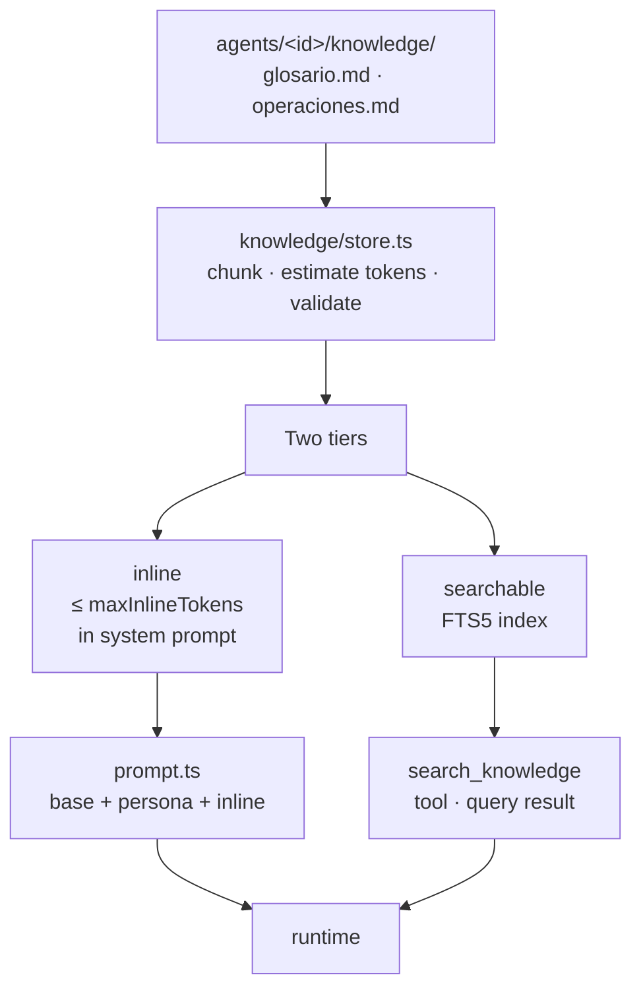
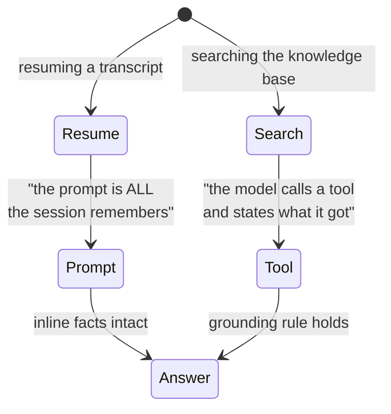
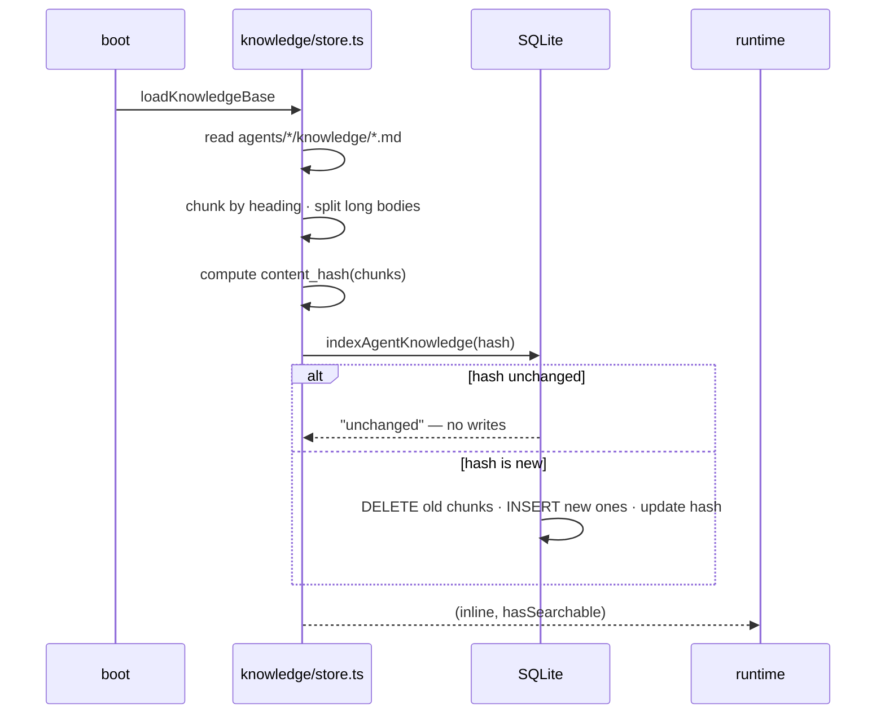
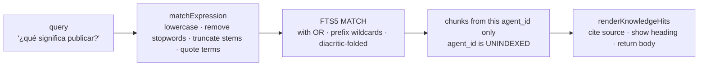

# The knowledge base

## Why two tiers

| Tier | Always? | Cost | When | Anchor |
|---|---|---|---|---|
| **INLINE** | Every turn carries the prompt | Billed on every turn | Vocabulary the agent never exists without | `agents/vitrina-inventario/knowledge/glosario.md` |
| **SEARCHABLE** | Only when searched | Only when the model searches | Procedures, policies, long content | `agents/vitrina-inventario/knowledge/operaciones.md` |

> ⚠️ Collapsing the tiers loses one property whichever way it collapses. Inline-only means
> a resumed turn arrives without procedures. Search-only means the agent's vocabulary comes
> from a tool call that a transcript crash can erase. `server/src/agent/definition.ts:265-287`

## Loading and indexing

| Step | Decision | Why |
|---|---|---|
| **Reading** | Path must resolve under `knowledge/` in agent's directory | Can't read outside the definition with path traversal |
| **Chunking** | Split long sections on paragraph boundaries, preserve heading | Each chunk stands alone, citation names the source |
| **Validation** | Budget, documents exist, tools mentioned in docs are declared | Deploy-time errors fail boot, not first turn |
| **Hashing** | Idempotent re-index, short-circuits unchanged content | No write lock on ordinary restart when nothing changed |

> ℹ️ Inline budget overstates on purpose (3 chars per token, real Spanish is ~4). Half a
> glossary reads like a whole one; truncation is invisible. `server/src/knowledge/store.ts:37-40`

> ℹ️ Transactions are IMMEDIATE so a booting process takes its write lock up front,
> and a second boot blocks, re-reads the hash inside the lock, and finds the work done.

## Search: the query path

| Concern | Mechanism | Anchor |
|---|---|---|
| **Scope guard** | `agent_id` UNINDEXED, filtered in SQL (not MATCH) | `server/src/knowledge/store.ts:544-566` |
| **Stemming** | Query words truncated to 6 chars, prefix wildcard | Handles Spanish inflection; FTS5 does not stem |
| **Stopwords** | Spanish function words dropped from query (not index) | Can't outvote the real word. Unfiltered if all words are stopwords |
| **Accent folding** | FTS5 tokenizer `remove_diacritics` on index AND query | "publicacion" finds "publicación" |

> ⚠️ Query stemming is crude but earns its place: "¿cómo publico?" would rank
> "Retirar un producto" first if "publico" had to match "publicar" exactly.
> Tested: measured on shipped documents. `server/src/knowledge/store.ts:49-67`

> ⚠️ One parameter, no scope: `search_knowledge` takes only `query`. The agent id comes
> from `ctx.turn.agentId`, set by the transport. Per-agent isolation is structural,
> never a filter. `server/src/knowledge/tool.ts:52-56`

## The documents that shipped

Currently, only the owner's agent has knowledge:

| Document | Tier | Anchor |
|---|---|---|
| **glosario.md** | INLINE | Terms (product states, SKU vs handle, variants, links, leads) |
| **operaciones.md** | SEARCHABLE | Procedures (publish, prices, new options, stock, photos, tags, cart) |

> ⚠️ **Customer-facing policies do not yet exist.** Returns, shipping, payment, and hours
> would belong in the sales agent's knowledge base, but publishing placeholder text reads
> as policy to a buyer — worse than no knowledge at all. When policies are written, they
> land as `.md` files under `agents/vitrina-ventas/knowledge/` and are declared in its
> definition.

**[← Agent & sessions](agente-y-sesiones.md)** · **[WhatsApp transport →](bridge-whatsapp.md)**

Verified against `8ae5acb` — 2026-09-06