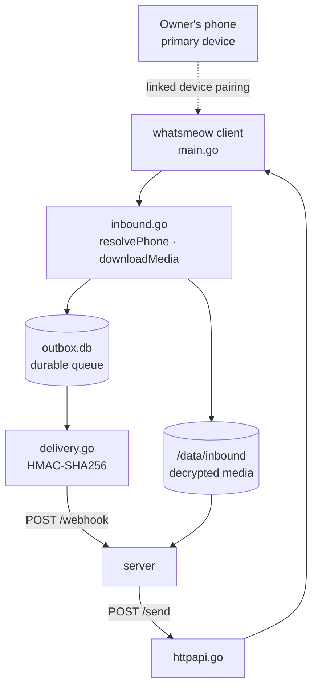
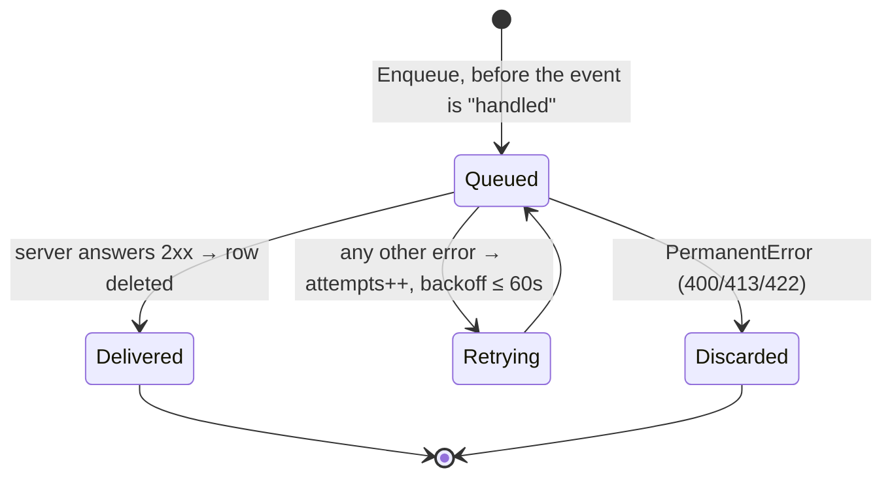
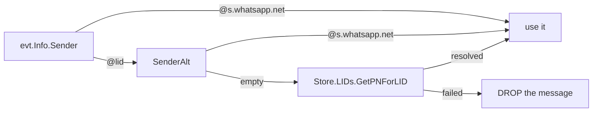

# The WhatsApp transport

One of **two** transports and the default one; `WHATSAPP_PROVIDER` picks. The sidecar pairs
as a **linked device** and speaks the WhatsApp Web multidevice protocol via whatsmeow — no
WhatsApp Business onboarding, no per-conversation fee.

> ℹ️ Meta's official alternative: [`cloud-api-whatsapp.md`](cloud-api-whatsapp.md)

> ⚠️ **And no official standing with Meta.** The paired number carries real ban risk, and
> it is unlinked whenever the primary phone stays offline past WhatsApp's window. That
> failure is **silent**: the process keeps running and simply stops receiving.

| Endpoint | Auth | Reports |
|---|---|---|
| `/health` | none | Process liveness **only**, deliberately not the connection |
| `/status` | Bearer `BRIDGE_API_TOKEN` | `connected`, `loggedOut`, `pairedAs`, `outboxPending` |
| `/send` | Bearer `BRIDGE_API_TOKEN` | Sends as the paired number |

> ℹ️ Watch `/status`, not `/health`. A restart cannot fix being logged out, so failing
> health on it would produce a crash loop that hides the real problem.
> `bridge/httpapi.go:167`

## The outbox is not optional

> ⚠️ whatsmeow acks to WhatsApp the moment an event is handled. Anything not durable at
> that instant is gone for good — it never reaches the `inbox` table either, so
> `replayPending` cannot recover it. `bridge/outbox.go:17`

Delivery is **strictly sequential by insertion id**, and that is a requirement, not a
simplification: photo order is listing order, and a concurrent dispatcher letting photo 4
overtake photo 2 would quietly reorder the owner's listing. `bridge/outbox.go:123`

> ℹ️ Auth failures and a wrong URL are **retried**, not discarded: those are operator
> mistakes that get fixed, and losing a real message over a typo is the worse outcome.
> `bridge/delivery.go:44`

## A LID is not a phone number

> ⚠️ A LID's digits look exactly like a phone number to `normalizePhone`, so one reaching
> the server misses `OWNER_PHONE_NUMBERS` and the owner silently reads as a **customer** —
> while a reply to it goes to whoever really owns those digits. `bridge/inbound.go:104`

> ℹ️ The LID store must be looked up **per call**, never captured at construction: an
> unpaired device has no sub-stores at all, so reading it at startup panics on first boot.
> `bridge/inbound.go:84`

## Media never crosses HTTP between our own services

| Step | Where |
|---|---|
| whatsmeow decrypts straight to a file | `bridge/inbound.go:142` |
| The event carries a **path**, not bytes | `bridge/inbound.go:47` |
| The server confines that path to the staging dir | `server/src/whatsapp/bridge.ts:31` |
| The server reads it, then unlinks — **on the worker**, not in the handler | `server/src/whatsapp/bridge.ts:114` |

> ⚠️ `isAllowedMediaPath` is load-bearing. The ref arrives in a signed body, but a
> signature proves origin, not good behaviour — and the value is fed straight to
> `readFile`. A ref of `../../data/vitrina.db` would hand over the database as a photo.

> ⚠️ A staged file now outlives the ACK: the webhook records its path and the worker reads
> it when the burst's window closes. A redelivery must therefore **not** release that path —
> the first row still needs it. `server/src/inbox/webhook.ts:242`

> ⚠️ The bridge container runs as **uid 1000**, matching the server image's `node` user,
> because both mount the staging volume. Mismatched uids mean the server reads every photo
> fine and silently leaks all of them — `releaseMedia` swallows errors by design.

## Pairing

Phone-code pairing keeps the whole flow inside the container logs: set
`BRIDGE_PAIR_PHONE` to bare E.164 digits and read the 8-character code out of the log.
Unset falls back to a QR rendered in the logs. `bridge/main.go:78`

> ⚠️ `pairDisplayName` is `"Chrome (Linux)"` and is **not** free text. WhatsApp validates
> it server-side; a product name there makes pairing impossible, and the failure is an
> opaque `bad-request` that says nothing about the name. `bridge/main.go:69`

**[← Agent & sessions](agente-y-sesiones.md)** · **[The Cloud API transport →](cloud-api-whatsapp.md)**

Verified against `36e95b2` — 2026-08-25
