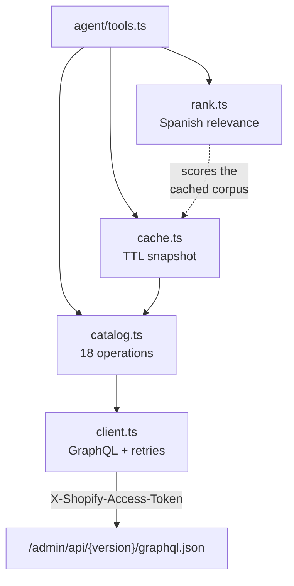
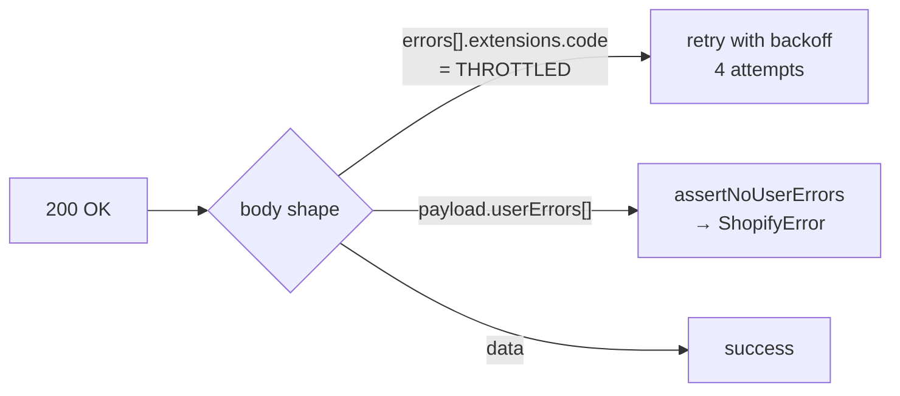
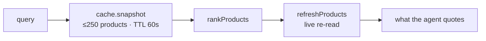

# The Shopify layer

| Module | Owns | Anchor |
|---|---|---|
| `client.ts` | Transport, throttling, `userErrors`, money formatting | `server/src/shopify/client.ts:68` |
| `catalog.ts` | Every read and write, flattened into our own types | `server/src/shopify/catalog.ts:27` |
| `rank.ts` | Relevance, the `match=NN%`, the approximate-match warning | `server/src/shopify/rank.ts:231` |
| `cache.ts` | A disposable corpus for ranking. Not a mirror | `server/src/shopify/cache.ts:27` |

## Two failures that arrive as HTTP 200

> ⚠️ `userErrors` is a **response field**, not an HTTP status. A client that only checks
> `res.ok` reports a rejected price change to the owner as success. It must be asserted on
> **every** mutation payload. `server/src/shopify/client.ts:173`

> ℹ️ Retries live in the client, not only at the batch level: the Admin API is a leaky
> bucket of query cost, and letting a throttle bubble up would re-run the entire turn
> 30 s later — including mutations that already succeeded.

## Money is a string

`toMoneyString` is the only place a number becomes money, and it runs on **writes only**.
Reads pass through the decimal string Shopify returned. `server/src/shopify/client.ts:196`

> ⚠️ No stored price is ever rebuilt from a float. `rank.ts` parses a float exactly once,
> to compare against a budget, and discards it. `server/src/shopify/rank.ts:200`

## Cache is for ranking, never for quoting

| Concern | Where it is answered |
|---|---|
| Which products answer the question | The cached snapshot |
| What the price and stock actually are | A live `refreshProducts` call |
| How stale can a brand-new product be | Up to `CATALOG_CACHE_TTL_MS` before it is findable by text |

The cache also de-duplicates in-flight fetches: a photo burst waking three tool calls at
once would otherwise run three full catalog fetches. `server/src/shopify/cache.ts:34`
Every write calls `invalidate()`. `server/src/shopify/cache.ts:81`

## Why the ranker exists at all

Shopify's `products(query:)` is prefix matching: no accent folding, no typo tolerance,
and — decisively — **no comparable score**.

| Signal | Treatment | Anchor |
|---|---|---|
| `min_price` / `max_price` | **Excludes**. A stated constraint, not a preference | `server/src/shopify/rank.ts:238` |
| `in_stock_only` | **Excludes**. Sold out cannot be bought at any relevance | `server/src/shopify/rank.ts:241` |
| `query` | **Scores** only. Prose arrives however the person said it | `server/src/shopify/rank.ts:249` |

| Constant | Value | Meaning |
|---|---|---|
| `DEFAULT_MIN_SCORE` | 0.6 | Below this, a product does not come back at all |
| `CONFIDENT_MATCH_SCORE` | 0.8 | Below this, the result carries `APPROXIMATE MATCHES ONLY` |
| `MAX_SEARCH_RESULTS` | 10 | Customer search only — never the owner's report |

> ⚠️ Scoring tricks that are easy to break: stopwords stop a long question from capping
> its own score, glued adjacent pairs make word breaks stop mattering, and a bare number
> is matched **exactly** so "talla 38" is never answered by a price of 380.
> `server/src/shopify/rank.ts:52`, `:91`, `:160`

> ℹ️ `min_score` is deliberately **not** a tool parameter. The relevance floor is policy;
> the agent does not get to widen its own search until something finally appears.
> `server/src/agent/tools.ts:212`

**[← Message pipeline](pipeline-mensajes.md)** · **[Agent & sessions →](agente-y-sesiones.md)**

Verified against `6f9211b` — 2026-08-24
