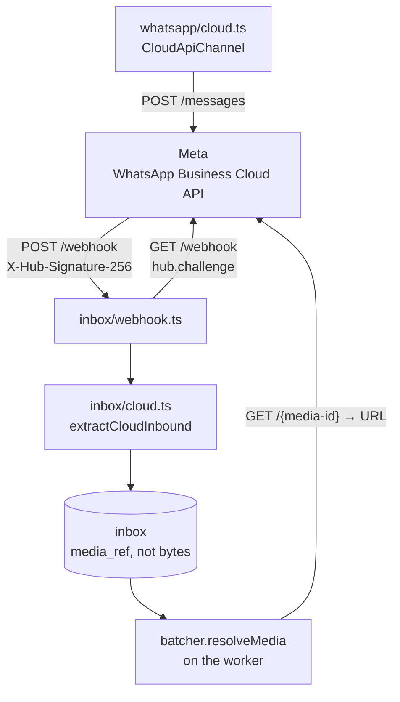
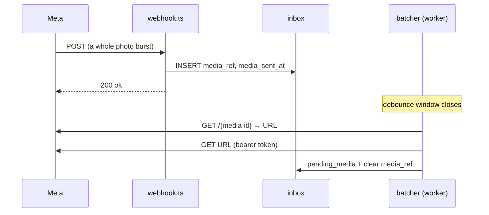

# The Cloud API transport

`WHATSAPP_PROVIDER` picks the transport and both sit behind `WhatsAppChannel`, so the
cut-over is one variable and a restart — a rollback is the same, not a revert. It defaults
to `bridge`, so an untouched deployment boots unchanged. `server/src/config.ts:296`

> ℹ️ Unlike the bridge this is Meta's **official** channel: no ban risk and no silent
> unlinking. The price is a registered number that can no longer be used from the WhatsApp
> app, and a 24-hour reply window. Panel runbook: [`../whatsapp-cloud-api.md`](../whatsapp-cloud-api.md)

## Five differences that are behaviour, not plumbing

| # | Difference | Consequence |
|---|---|---|
| 1 | **One POST carries many messages** | The handler loops; reading only the first drops the rest of a burst. `server/src/inbox/cloud.ts:210` |
| 2 | **A message id is REQUIRED** | The content-hash dedupe fallback would key one POST's messages identically and swallow all but the first. `server/src/inbox/cloud.ts:112` |
| 3 | **The signature is `X-Hub-Signature-256`, keyed with the APP SECRET** | A different secret from the verify token, which is only echoed during the GET handshake. `server/src/config.ts:320` |
| 4 | **Media is an id, not a path** | The URL it resolves to expires in ~5 min, so the id travels and the URL is fetched at download time. `server/src/whatsapp/cloud.ts:202` |
| 5 | **Delivery order is not guaranteed** | The bridge's outbox gave a strict one. `pending_media.sent_at` now orders the gallery. |

> ⚠️ Status callbacks arrive on the **same URL** and far outnumber real messages. One
> parsed as inbound would answer a customer who never wrote, so `field !== "messages"` and
> a non-WhatsApp `object` are skipped rather than half-read. `server/src/inbox/cloud.ts:49`

## The webhook downloads nothing

Fetching one file costs **two Graph round trips**, and one POST can carry an owner's whole
listing. Done inside the handler that held the response open for minutes.
`server/src/inbox/batcher.ts:316`

> ⚠️ **Meta retries a slow webhook and can eventually disable the subscription.** That
> failure appears in Meta's delivery panel, not in the server log — the same class of
> silent break as the bridge's unlinking. The handler stores a reference and ACKs.
> `server/src/inbox/webhook.ts:229`

> ⚠️ A redelivery must **not** release its media reference. The first copy's row still owns
> it and has not fetched it, so releasing would delete the file that row is waiting for.
> `server/src/inbox/webhook.ts:242`

## Only Meta hosts may receive the token

| Check | Why |
|---|---|
| `https:` only | A token on a plaintext hop is a leaked token |
| Exact host, or a `.fbcdn.net` / `.fbsbx.com` / `.facebook.com` **suffix with the dot** | `evil-fbcdn.net` is a suffix match without it |

> ⚠️ The download URL comes out of a *response*, and we attach a permanent system-user
> token — the credential that can send WhatsApp messages as the business. Validate before
> you dereference, exactly as `isAllowedMediaPath` does on the bridge side.
> `server/src/whatsapp/cloud.ts:53`

## Outbound: the 24-hour window and the 4096-character limit

| Error | Means | Fix |
|---|---|---|
| `131047` | Free-form reply outside the 24h window | Only an approved template goes through |
| `131009` | Parameter rejected — usually a body over 4096 chars | `splitForWhatsApp`, `server/src/whatsapp/cloud.ts:78` |
| `190` | Token invalid or expired | Regenerate the **System User** token, not the 24h panel one |

> ⚠️ A failed `statuses` callback is the ONLY place a send Meta *accepted* and then could
> not deliver ever shows up: the POST that carried the reply already returned 200. They are
> logged for that reason alone. `server/src/inbox/cloud.ts:239`

**[← The bridge transport](bridge-whatsapp.md)** · **[Deployment →](despliegue.md)**

Verified against `36e95b2` — 2026-08-25
