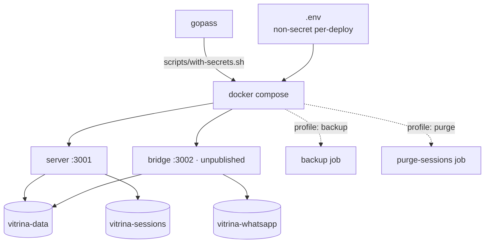
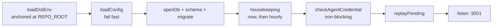

# Deployment



| Volume | Holds | Losing it costs |
|---|---|---|
| `vitrina-data` | `vitrina.db`, media, `/data/inbound` staging | Inbox, leads, sessions, pending photos |
| `vitrina-sessions` | Agent SDK transcripts + cache | Conversation history. Replies still work |
| `vitrina-whatsapp` | whatsmeow pairing + outbox | **Re-pairing the number by hand.** Not disposable |

## Secrets

```bash
./scripts/with-secrets.sh docker compose up -d
```

> ⚠️ `docker compose up`/`run` **must** go through that wrapper. `SHOPIFY_STORE_DOMAIN`
> and `SHOPIFY_ADMIN_TOKEN` are interpolated with no default, so a bare `up` starts a
> server that fails its boot check. `docker compose build` works bare.

| Injected from gopass | Read from `.env` |
|---|---|
| `ANTHROPIC_API_KEY` / `ANTHROPIC_AUTH_TOKEN` | `OWNER_PHONE_NUMBERS` |
| `BRIDGE_WEBHOOK_SECRET`, `BRIDGE_API_TOKEN` | `PUBLIC_BASE_URL`, `MODEL`, batching knobs |
| `SHOPIFY_STORE_DOMAIN`, `SHOPIFY_ADMIN_TOKEN` | `SHOPIFY_API_VERSION`, `SHOPIFY_LOCATION_ID` |

See [`shopify-setup.md`](../shopify-setup.md) for minting the Shopify token, and
[`secrets-management.md`](../secrets-management.md) · [`gopass-setup.md`](../gopass-setup.md)
for the store itself.

## Boot sequence



> ⚠️ `loadDotEnv` anchors at `REPO_ROOT`, **not the cwd**, and swallows a missing file.
> `npm run <script> -w server` runs from `server/`, where a cwd-relative `.env` misses
> silently — and an empty `OWNER_PHONE_NUMBERS` makes every phone a customer.
> `server/src/config.ts:318`

> ℹ️ The credential check never blocks startup: the inbox is durable, so messages that
> arrive during a credential outage are replayed once the key is fixed. Refusing to boot
> would drop them. `server/src/index.ts:111`

## Housekeeping, on boot and hourly

| Sweep | TTL | Anchor |
|---|---|---|
| Unattached `pending_media` + their files | 48 h | `server/src/index.ts:63` |
| Settled `inbox` rows | 7 d done, 30 d failed | `server/src/data/repo.ts:266` |
| Orphaned agent transcripts | `SESSION_MAX_AGE_DAYS` | `server/src/data/transcripts.ts:79` |
| Orphaned staged media | 24 h | `server/src/whatsapp/bridge.ts:55` |

> ⚠️ `AGENT_TRANSCRIPTS_DIR` must **never** get a default. The SDK stores transcripts at
> `$HOME/.claude/projects/<cwd-with-slashes-as-dashes>/`, which on a developer's machine
> is that developer's own Claude Code history for this repo. Unset, the sweep is inert.

## Health

| Check | Command | Meaning |
|---|---|---|
| server | `fetch /health` from inside the container | HTTP is up |
| bridge | `/bridge -healthcheck` | Process is alive — **not** that WhatsApp works |
| bridge, real | `/bridge -status` | `loggedOut: true` is the failure a restart cannot fix |

> ℹ️ Both healthchecks run the binary itself: the bridge image is distroless, so there is
> no shell and no curl for a `HEALTHCHECK` to use. `bridge/main.go:112`

## Ops levers

| Task | Command |
|---|---|
| Snapshot SQLite (safe under writes) | `docker compose --profile backup run --rm backup` |
| Drop every **customer** history | `docker compose --profile purge run --rm purge-sessions` |
| Kill the customer path entirely | `CUSTOMER_AGENT_ENABLED=false`, restart |

> ⚠️ The purge refuses to run on an empty `OWNER_PHONE_NUMBERS`: every session would look
> like a customer's, the owner's included, and the damage is silent and unrecoverable.
> `server/src/data/purge.ts:44`

**[← WhatsApp transport](bridge-whatsapp.md)** · **[Shopify setup →](../shopify-setup.md)** · **[Coolify runbook →](../coolify-deploy.md)**

<sub>Verified against `6f9211b` — 2026-08-24</sub>
