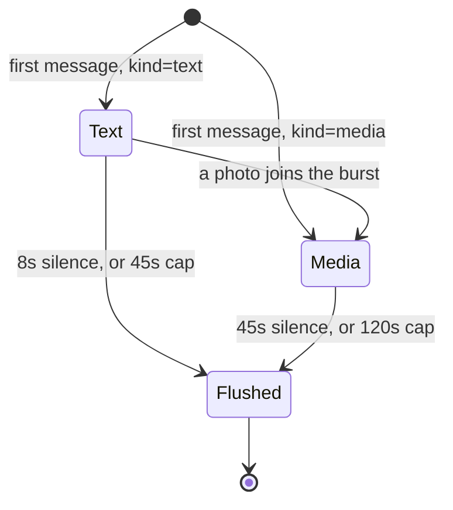
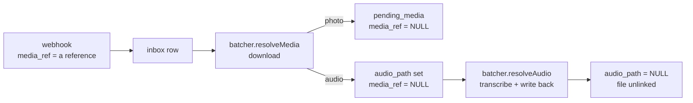

# The message pipeline

```mermaid
sequenceDiagram
    participant B as transport
    participant W as webhook.ts
    participant DB as inbox table
    participant BA as batcher.ts
    participant Q as queue.ts
    participant A as agent.ts

    B->>W: POST /webhook (signed; 1 event, or many)
    W->>W: verifySignature over the RAW body
    W->>DB: INSERT (UNIQUE dedupe_key, media_ref)
    W->>BA: schedule(phone, kind)
    W-->>B: 200 ok
    Note over BA: debounce — silence window + hard cap
    BA->>Q: enqueue(phone, processBatch)
    Q->>DB: claimInboxBatch → 'processing'
    Note over Q: resolveMedia — fetch the files, THEN resolveAudio
    Q->>A: runAgentTurn(ctx, joined text)
    A-->>B: POST /send
    Q->>DB: markInboxBatchDone
```

## Why each stage exists

| Stage | Exists because | Anchor |
|---|---|---|
| Persist before processing | Delivery is at-least-once; a crash before the turn is replayed on boot | `server/src/inbox/webhook.ts:229` |
| Fast ACK | **Both** transports punish a slow handler: the bridge's outbox is strictly sequential, and Meta retries a slow webhook and can disable the subscription | `bridge/outbox.go:123` |
| Files fetched on the worker | Two Graph round trips per file, and one Cloud API POST can carry a whole burst | `server/src/inbox/batcher.ts:316` |
| Debounce | People type the way they talk; one turn per message meant a dozen Claude calls each seeing a fragment | `server/src/inbox/batcher.ts:174` |
| Per-phone queue | Batches for one phone must never overlap — this is what makes `claimInboxBatch` safe | `server/src/data/repo.ts:195` |

## The adaptive window



| Knob | Default | Env |
|---|---|---|
| Text silence | 8 s | `BATCH_DEBOUNCE_MS` |
| Text cap | 45 s | `BATCH_MAX_WAIT_MS` |
| Media silence | 45 s | `BATCH_MEDIA_DEBOUNCE_MS` |
| Media cap | 120 s | `BATCH_MEDIA_MAX_WAIT_MS` |

> ⚠️ `hasMedia` is **sticky** for the life of a burst. WhatsApp uploads a photo set in
> waves, and a text message landing between two waves must not shrink the window back
> down and split the upload in half. `server/src/inbox/batcher.ts:151`

> ℹ️ A measured burst of one listing — 37 photos, ~30 messages — arrived in two waves
> **32 seconds apart**. Any window that keeps chat responsive would have split it into
> two batches and answered the owner twice for one action.

## Joining a burst into one prompt

`buildBatchText` collapses runs of photos into a single counted line and groups their
captions underneath. `server/src/inbox/batcher.ts:60`

| Input rows | Prompt line |
|---|---|
| 1 photo, no caption | `(El usuario envió una foto)` |
| 10 photos | `(El usuario envió 10 fotos)` + their captions |
| voice note, transcribed | the transcript, as ordinary text |
| voice note, not transcribable | `AUDIO_FALLBACK`, `server/src/inbox/batcher.ts:99` |

> ⚠️ Photos are recognised by the persisted `kind`, **never** by their wording. WhatsApp
> stores a photo's caption as that message's text, so matching the placeholder counted
> only uncaptioned photos and an owner who captioned every one produced plain-looking chat.

## Files and voice notes run on the worker, never in the webhook



| State | Means | Cleared by |
|---|---|---|
| `media_ref` | Not fetched at all | `setInboxAudioPath` / `clearInboxMedia`, `server/src/data/repo.ts:228` |
| `audio_path` | Bytes on our disk, awaiting transcription | `setInboxTranscript`, `server/src/data/repo.ts:212` |

> ⚠️ Each hand-off clears the state it supersedes in **one statement** — that clearing is
> what marks the work as paid for. Collapse the two and a retried batch re-downloads a
> file we already hold. `server/src/data/repo.ts:244`

> ⚠️ A voice note that yields no words still needs a **line**. `buildBatchText` renders
> nothing for an empty row and an empty batch settles `done` without an agent turn — the
> exact silence `AUDIO_FALLBACK` exists to prevent. `server/src/inbox/batcher.ts:392`

> ⚠️ A voice note is persisted as `kind='text'`, not `'media'`. Its transcript is a line
> the person spoke, not a caption under a photo count — and the media window would make a
> single voice note wait 45 s for a reply. `server/src/inbox/webhook.ts:203`

**[Shopify layer →](capa-shopify.md)** · **[Flow: one inbound message →](../02-flujos/mensaje-entrante.md)**

<sub>Verified against `36e95b2` — 2026-08-25</sub>
