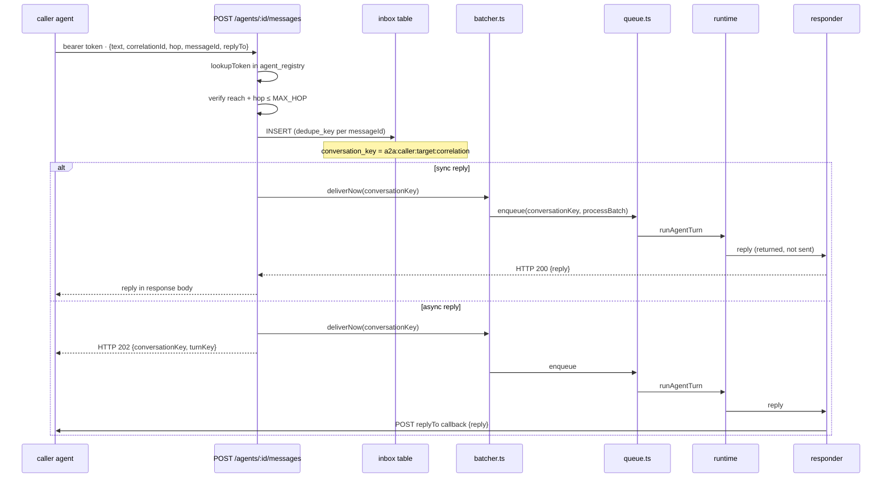
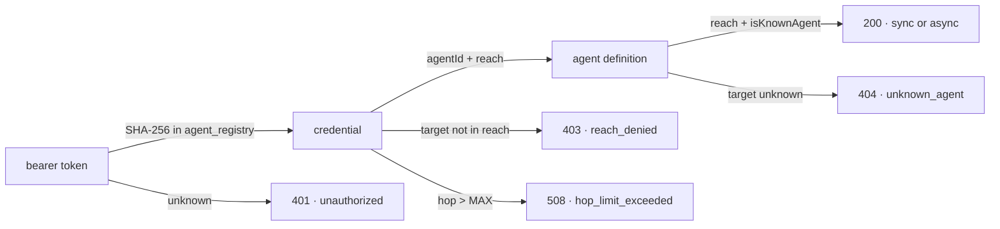

# The agent door



## Authentication and authorisation

The bearer token is looked up **first**, before the body is even parsed.



| Failure | Why this order | Anchor |
|---|---|---|
| Unknown token first | An anonymous caller learns nothing about which agents exist | `server/src/inbox/a2a.ts:172` |
| Reach before existence | An authenticated caller cannot map by comparing 403 against 404 | `server/src/inbox/a2a.ts:193` |

> ⚠️ **Identity from the transport, never from the message.** The credential names the caller; the body schema is `.strict()`, so a field claiming to name the caller is a 400. `server/src/inbox/a2a.ts:67`

## Response codes

| Code | Error | Means | Retry safe |
|---|---|---|---|
| 200 | — | Sync reply in body | ✅ yes |
| 202 | — | Async callback will deliver it | ✅ yes |
| 400 | `invalid_request` | Body schema or identifier format | ✅ yes |
| 401 | `unauthorized` | Token absent, malformed, or unknown | ✅ yes |
| 403 | `reply_to_not_allowed` | Callback URL outside the allowed prefix | ✅ yes |
| 403 | `reach_denied` | Target not in the credential's reach | ✅ yes |
| 404 | `unknown_agent` | Target agent not known to this build | ✅ yes |
| 408 | — | Reserved; not returned by this endpoint | — |
| 409 | `conversation_busy` | One exchange already running on this key | ✅ yes, under new correlationId |
| 409 | `duplicate_message` | Same caller + target + messageId already claimed | ✅ yes |
| 502 | `turn_failed` | Retry budget spent; inbox row settled `failed` | ❌ no |
| 504 | `no_reply_in_time` | Inbox row still in play, may answer on retry | ✅ yes |
| 508 | `hop_limit_exceeded` | hop > MAX_HOP | ✅ yes |

## The conversation key and one exchange at a time

```
a2a:{caller_id}:{target_id}:{correlation_id}
```

A conversation is keyed by **both ends plus the correlation**. Two calls from the same caller asking the same target under different correlations hold separate transcripts. The namespace prevents collision with WhatsApp phone numbers, and `claimInboxBatch` serialises by key — one exchange at a time per agent pair and correlation.

> ⚠️ If a caller could name a bare phone number as its correlation, it would claim and answer that person's pending WhatsApp messages, receiving their words in its own response body. The prefix is added here, in the door, and a caller cannot remove it. `server/src/inbox/envelope.ts:124`

## Idempotency and retries

The optional `messageId` is an idempotency handle. Sending the same one twice returns 409 instead of a second answer. Without one, each request lands a fresh row.

A retry is safe under these conditions:
- A new `messageId` — treated as a fresh request
- A new `correlationId` — separate transcript, separate serialisation
- The same `messageId` + `correlationId` — dedupe returns 409 on second arrival

> ⚠️ A 409 is retriable but not under the same key. The caller may wait and ask again under a new correlation, or overwrite the row by changing the messageId. Either way, the retry starts a fresh agent turn — the first one is abandoned.

## The hop guard

```
hop = Math.max(body.hop ?? 1, 1)
if (hop > MAX_HOP) return 508
const outbound_hop = ctx.turn.hop + 1
```

Arriving at the door counts as a hop. The cap is compared against what the caller said, because that is the length of the chain it knows about. On the way out, `ask_agent` adds one more for the outbound call.

> ⚠️ The hop comes from the turn, never from the model. `ask_agent` has two parameters and neither is a hop — the tool cannot let a prompt injection reset the counter. `server/src/tools/packs/agents.ts:73`

> ⚠️ An agent that calls itself is a loop whose every leg looks legitimate and would never grow a counter enough to be caught. It is refused at the door: `callerAgentId === targetAgentId` → 403. `server/src/inbox/a2a.ts:192`

**[Pipeline →](pipeline-mensajes.md)** · **[Knowledge →](base-conocimiento.md)**

<sub>Verified against `1928c6f` — 2026-09-06</sub>
