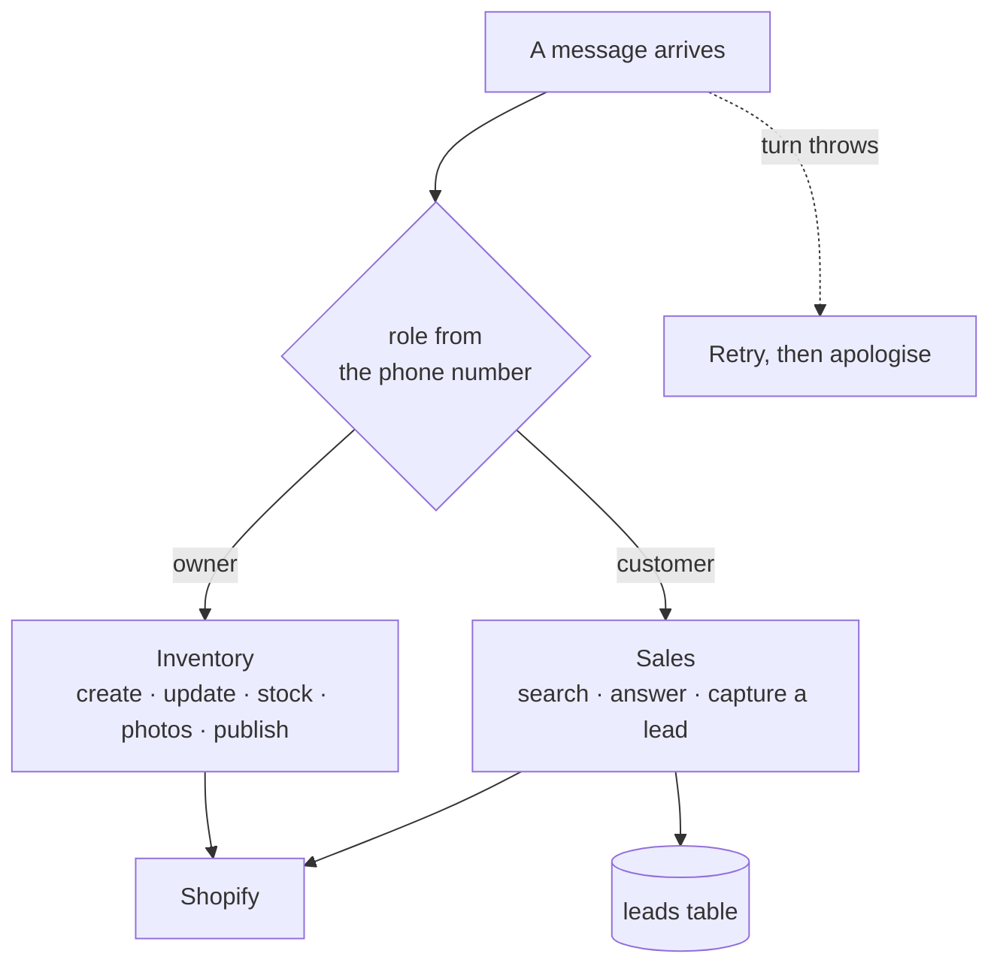
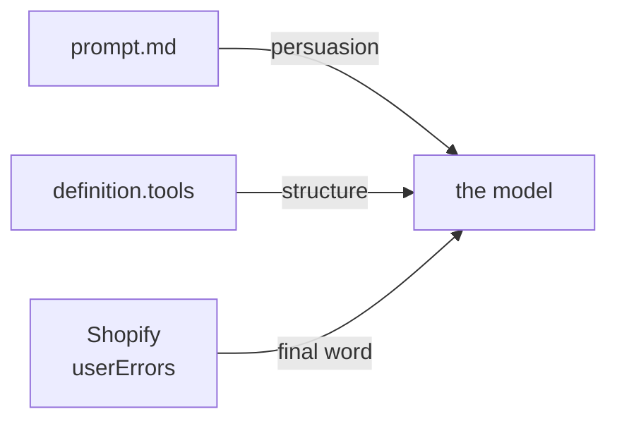
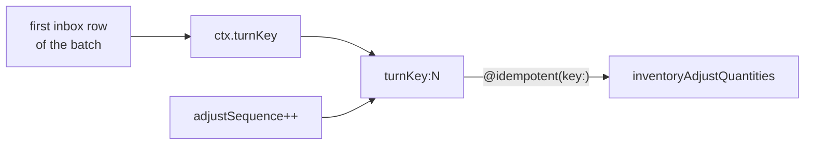

# 02 · Flows

| Page | Contents |
|---|---|
| [`mensaje-entrante.md`](mensaje-entrante.md) | One inbound message, end to end, including photos and voice |
| [`inventario-dueno.md`](inventario-dueno.md) | The owner's path: listing a product, moving stock, publishing |
| [`venta-cliente.md`](venta-cliente.md) | The customer's path: searching, availability, leads |
| [`fallos-y-reintentos.md`](fallos-y-reintentos.md) | What retries, what gives up, what the owner hears about it |

## What the system will not do

| Not supported | Why |
|---|---|
| Checkout, payment, shipping quotes | Milestone 1 is inventory. The customer path captures a lead instead |
| Sending images out over WhatsApp | Outbound is text-only; a product's photos live on its storefront page |
| Buttons and list messages | A Cloud API feature a linked-device client cannot render |
| Group chats | Dropped at the bridge — they would create phantom conversations, `bridge/inbound.go:195` |
| Reserving or holding stock | The agent is told plainly it cannot, `agents/vitrina-inventario/prompt.md` |

## Where the business rules actually live

The persona is read from `agents/<id>/prompt.md`; the tool set comes from `agents/<id>/agent.yaml`
and is served from `server/src/tools/registry.ts`.

| Rule kind | Enforced by | Can the model route around it? |
|---|---|---|
| "Never invent a price" | Prompt only | Yes, in principle — which is why grounding is repeated per tool result |
| "A customer has no `set_price`" | Tool set (not in definition) | No |
| "A draft is invisible to customers" | Tool implementation (read from port) | No |
| "A handle must be unique" | Shopify `userErrors` | No |

> ⚠️ Anything defended only by the prompt is defended by persuasion. The role boundary is
> deliberately structural instead — it is enforced by which tools exist for the turn.

## Idempotency, in one picture

> ⚠️ A stock `delta` is not idempotent and delivery is at-least-once. The key is the
> **first** row's dedupe key — stable across retries even as the batch absorbs newer
> messages. `server/src/inbox/batcher.ts:375`

> ℹ️ The per-turn counter suffix exists because two adjustments in one turn would
> otherwise share a key and Shopify would discard the second as a duplicate.
> `server/src/tools/factory.ts` — ToolContext carries the counter

Verified against `6f9211b` — 2026-08-24
