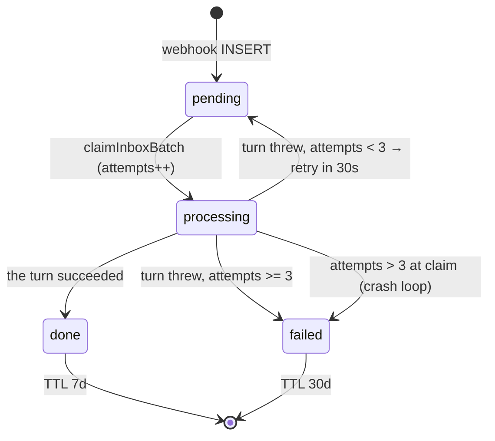
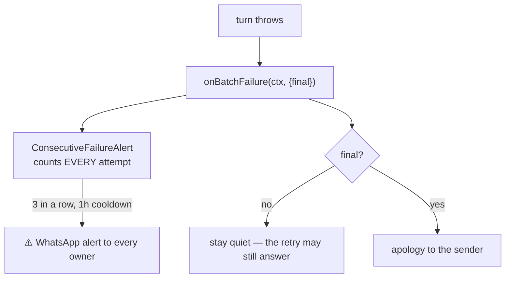

# Flow · Failures and retries

| Value | Where | Meaning |
|---|---|---|
| `MAX_BATCH_ATTEMPTS = 3` | `server/src/inbox/batcher.ts:22` | Total attempts, not extra retries |
| `RETRY_DELAY_MS = 30_000` | `server/src/inbox/batcher.ts:30` | Fixed, not configurable |
| `inbox.attempts` | `server/src/data/db.ts:79` | Incremented **at claim time**, so it survives restarts |

> ⚠️ Counting at claim time is what stops a poison message from crash-looping forever:
> boot-replay of a `processing` row counts against the same cap.

> ℹ️ Backoff escalation was left out deliberately. With only two retries ever it buys
> nothing, and a new env var is not worth its surface for a pilot.

## Where a failure surfaces

> ⚠️ The apology fires **only on the terminal attempt**. Apologising on attempt 1 and then
> answering correctly on attempt 2 reads as a broken bot. `server/src/index.ts:200`

> ℹ️ The failure streak counts every attempt, not only terminal ones: this alert is the
> pilot's outage monitor, and waiting for terminal failures would delay detection by the
> whole retry budget. `server/src/inbox/alerts.ts:7`

## What survives a restart

| Thing | Survives? | How |
|---|---|---|
| Un-flushed burst | ✅ | Rows stay `pending`, `replayPending()` on boot |
| Batch waiting out its 30 s retry | ✅ | Same — `stop()` drops timers, not rows |
| Attempt budget | ✅ | Persisted in `inbox.attempts` |
| In-flight agent turn | ✅ as a retry | Row stays `processing`, re-claimed on boot |
| Event still in the bridge outbox | ✅ | Durable SQLite queue with unbounded retry |
| Rate-limit counters | ❌ | In-memory, by design |
| Failure streak | ❌ | In-memory, by design |

## Failure modes and what to do

| Symptom | Likely cause | Check |
|---|---|---|
| Everything silent, `/health` fine | Device unlinked | `/bridge -status` → `loggedOut: true`. **Re-pair** |
| Every turn fails, "exited with code 1" | Credential rejected | The boot log line from `checkAgentCredential` |
| Owner reads as a customer | LID reached the server, or empty allowlist | `bridge/inbound.go:104`, `OWNER_PHONE_NUMBERS` |
| Server boots then dies | Missing `SHOPIFY_*` | Did the command go through `with-secrets.sh`? |
| Photos never attach | Uid mismatch on the staging volume | Both containers must be uid 1000 |
| "Publicado" but invisible | `publishablePublish` failed | The tool's own WARNING text; publish from the admin |
| Prices look wrong after an admin edit | Cache TTL on the ranking corpus | Only affects *findability*; quoted facts are re-read live |

## Errors the agent is allowed to see

`failure()` renders a `ShopifyError` as a sentence the model can act on, and **rethrows
anything else** — an unexpected error must fail the batch and get retried, not be
explained away to the owner. `server/src/agent/tools.ts:47`

| Error | Reaches the agent as |
|---|---|
| `userErrors` from a mutation | `"Updating the product failed. productUpdate rejected: …"` |
| Throttled past 4 attempts | `"… failed. Shopify throttled the request"` |
| Ambiguous location | `"The store has more than one location…: Bodega, Tienda"` |
| Anything else | Rethrown → batch retry |

> ⚠️ A `PermanentError` in the bridge outbox (400 / 413 / 422) **discards** the row with a
> loud log. Everything else, auth failures included, retries forever — an operator mistake
> gets fixed, a discarded message does not. `bridge/outbox.go:99`

**[← Customer's path](venta-cliente.md)** · **[Registered debt →](../DEUDA.md)**

Verified against `6f9211b` — 2026-08-24
