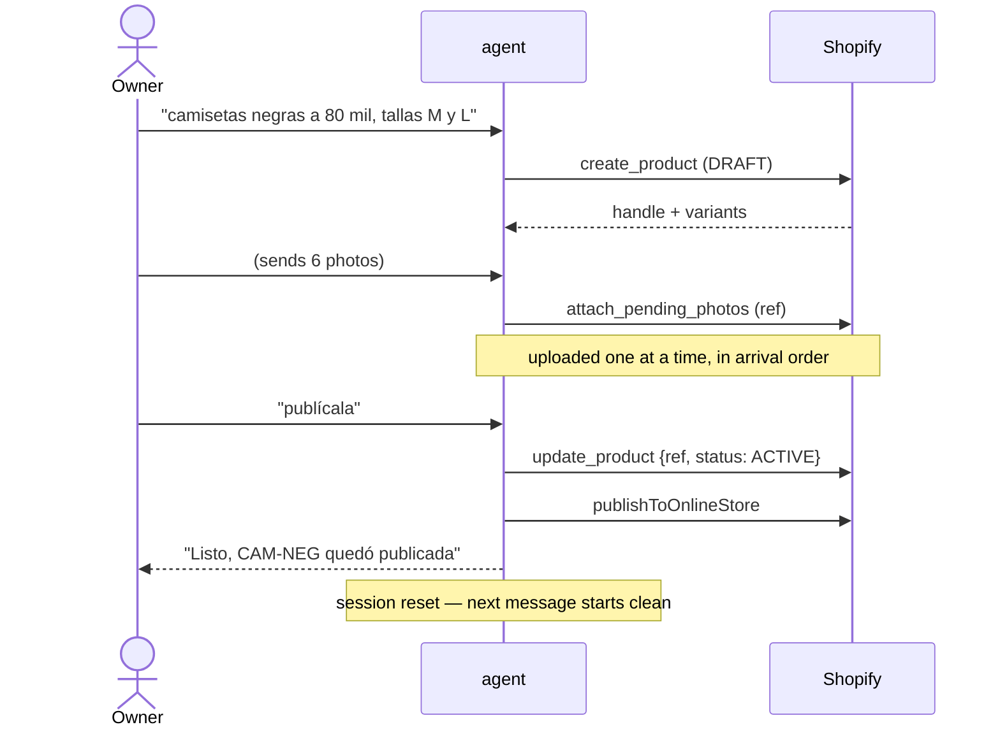
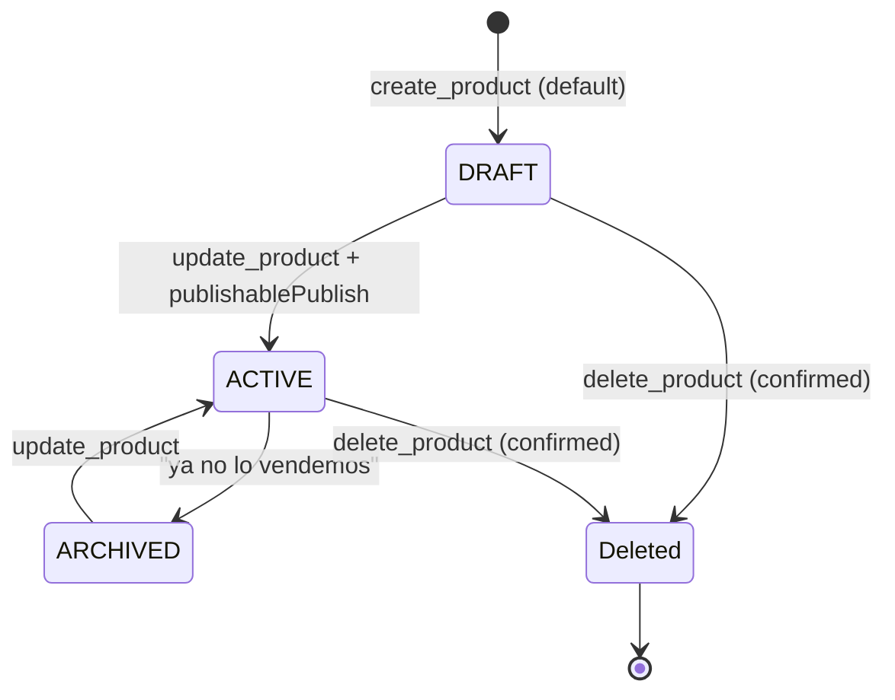
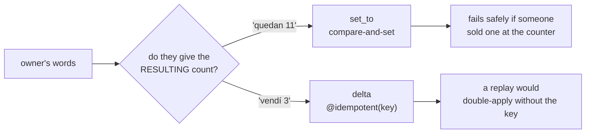

# Flow · The owner's inventory

## Product lifecycle

> ⚠️ **`status: ACTIVE` does not publish.** Putting a product on the storefront is a
> separate operation. A flow that sets ACTIVE, reports success and leaves the product
> invisible is the most plausible wrong-but-plausible bug here.
> `server/src/shopify/catalog.ts:725`

> ℹ️ `publishToOnlineStore` returns `false` rather than throwing: the status change
> already succeeded, and throwing would replay the whole turn over a reporting detail.
> The tool reports which of the two actually happened.

## The owner's tools

| Tool | Use for | Trap |
|---|---|---|
| `list_products` | "¿qué tengo?" — sees drafts and archived | An empty result is scoped to the filter, and says nothing else |
| `create_product` | Something that does not exist yet | Always creates a **second** one if it already existed |
| `update_product` | Everything except stock | **Merge, not rewrite** — but `tags` REPLACES the whole list |
| `delete_product` | Almost never | Permanent; requires the exact handle echoed back |
| `get_inventory` | Before quoting any number | Per variant **and** per location |
| `adjust_inventory` | Stock, and only stock | Prefer `set_to` over `delta` |
| `attach_pending_photos` | After the owner sends photos | Consumes every unattached row for that phone |
| `list_locations` | A stock question is ambiguous | — |
| `list_leads` | Reviewing what customers asked for | — |

> ⚠️ `update_product` sends only the keys present in the input — **except `tags`**, which
> replaces the entire list. An agent that does not know this silently drops every other
> tag, so the tool description and the prompt both say it.
> `server/src/agent/tools.ts:386`

> ⚠️ `createProduct` deliberately does **not** use `productSet`. `productSet` is
> declarative over the whole product: variants absent from the input are deleted. Right
> for a sync job, exactly wrong behind a chat agent. `server/src/shopify/catalog.ts:458`

## Stock: set_to versus delta

| | `set_to` | `delta` |
|---|---|---|
| Mutation | `inventorySetQuantities` | `inventoryAdjustQuantities` |
| Safety net | `compareQuantity` against the current count | `@idempotent(key: turnKey:N)` |
| Reads first | Yes — `getInventoryLevels` | No |
| Anchor | `server/src/shopify/catalog.ts:420` | `server/src/shopify/catalog.ts:367` |

> ⚠️ Stock is per **variant** and per **location**. `adjust_inventory` requires a SKU;
> "the product" is never a valid target. With several locations and none stated,
> `resolveLocation` throws rather than guessing. `server/src/shopify/catalog.ts:284`

## Resolving what the owner meant

`resolveProduct` tries gid → SKU → handle, then returns `null`.
`server/src/shopify/catalog.ts:211`

> ⚠️ It **never** falls through to a text search. A fuzzy match that then feeds
> `delete_product` is how the wrong product gets deleted — which is also why the delete
> tool makes the caller echo the exact handle. `server/src/agent/tools.ts:471`

## Photos

| Rule | Anchor |
|---|---|
| Uploaded strictly one at a time | `server/src/shopify/catalog.ts:775` |
| Arrival order is listing order; the first becomes the cover | `server/src/data/repo.ts:348` |
| Rows are **not** claimed before the upload | `server/src/data/repo.ts:346` |
| Only the ids that actually landed are marked | `server/src/agent/tools.ts:614` |

> ℹ️ A concurrent map would be faster and would silently shuffle the gallery. A partial
> failure leaves the rest claimable by a second attempt.

**[← One inbound message](mensaje-entrante.md)** · **[Customer's path →](venta-cliente.md)**

Verified against `6f9211b` — 2026-08-24
