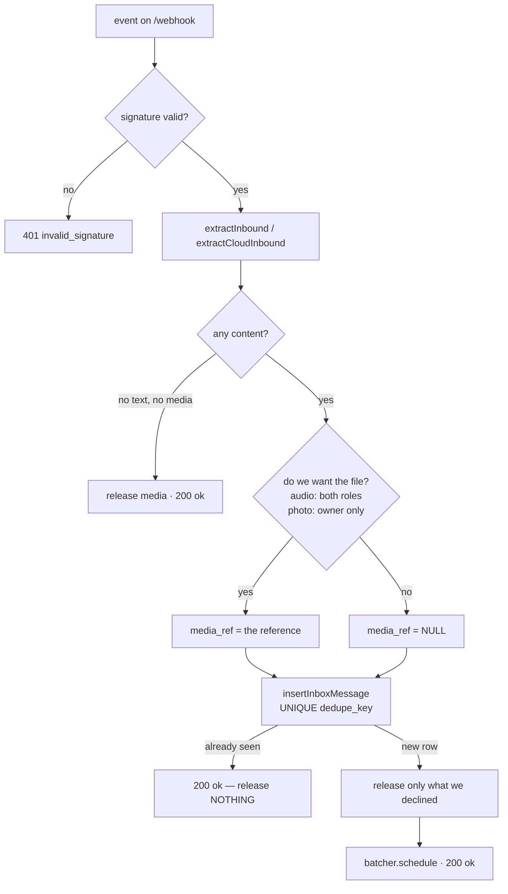
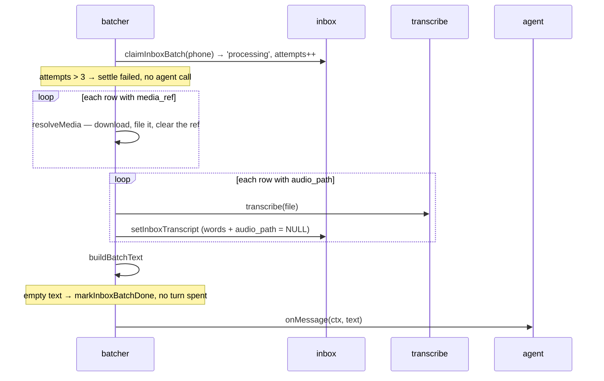

# Flow · One inbound message

## The three things the handler decides

| Decision | Rule | Anchor |
|---|---|---|
| Is this ours? | `provider === "whatsmeow"`, else parse nothing | `server/src/inbox/whatsmeow.ts:25` |
| Is it worth keeping? | Text, **or** an image, **or** audio. Everything else settles quietly | `server/src/inbox/webhook.ts:150` |
| Whose photo is this? | Owner photos are referenced for the worker; customer photos are released unread | `server/src/inbox/webhook.ts:209` |

> ⚠️ A customer's photo is never stored **and** never left behind. The bridge already
> wrote a decrypted file by the time we see it, so "we don't keep it" still means a file
> to delete. `server/src/whatsapp/bridge.ts:124`

> ⚠️ **The handler downloads nothing.** It records a reference and ACKs; the file is
> fetched on the worker. On the Cloud API that is two Graph round trips per file and one
> POST can carry a whole burst, and both transports punish a slow handler — Meta retries
> and can disable the subscription, the bridge stalls every message behind it.
> `server/src/inbox/batcher.ts:316`

> ℹ️ Audio takes its own path for **both** roles — a customer's voice note is the
> customer's actual question — but must never reach `pending_media`, because
> `attach_pending_photos` consumes every unattached row with no type filter.

## Dedupe

`stableEventKey` prefers the WhatsApp message id, and falls back to a SHA-256 of the whole
event. `server/src/inbox/webhook.ts:56`

| Situation | What happens |
|---|---|
| Bridge outbox redelivers | `INSERT OR IGNORE` returns no row → 200, and **nothing is released** |
| Redelivery carried a file | The first copy's row still owns that reference and has not fetched it — releasing would delete the file it is waiting for |
| Server crashed after insert | Row stays `pending`/`processing`, replayed on boot |

## From row to prompt

| Gate before the agent runs | Effect |
|---|---|
| `CUSTOMER_AGENT_ENABLED=false` and not owner | Static Spanish notice, no Claude call. Batch settles `done` |
| Rate limit hit (customers only) | Warn log, at most one notice per hour per phone. Batch settles `done` |
| Empty joined text | Batch settles `done`, no turn |

> ⚠️ Both gates settle the batch as **done**, not failed. They are deliberate consumption,
> not an error — retrying them would spend the same turn again for the same answer.
> `server/src/index.ts:169`

## Ordering guarantees

| Guarantee | Mechanism |
|---|---|
| Photos keep the order the owner shot them | Bridge outbox is sequential by insertion id |
| A phone's messages join the prompt in arrival order | `ORDER BY received_at ASC, id ASC` |
| Two batches for one phone never overlap | `PerPhoneQueue` |
| Different phones stay concurrent | One tail promise per phone |
| Replayed rows enter before new traffic | `replayPending()` runs **before** `listen()` |

> ℹ️ `received_at` is only second-resolution, which is why `id` breaks the tie. A burst
> arrives well inside one second. `server/src/data/repo.ts:199`

**[Owner's inventory path →](inventario-dueno.md)** · **[← Pipeline architecture](../01-arquitectura/pipeline-mensajes.md)**

Verified against `36e95b2` — 2026-08-25
