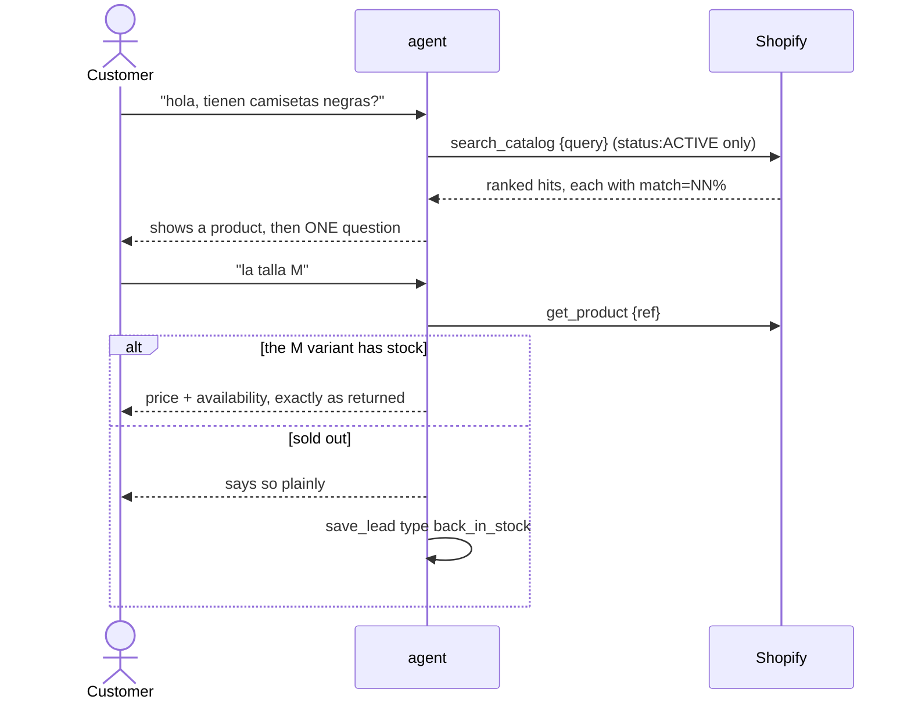
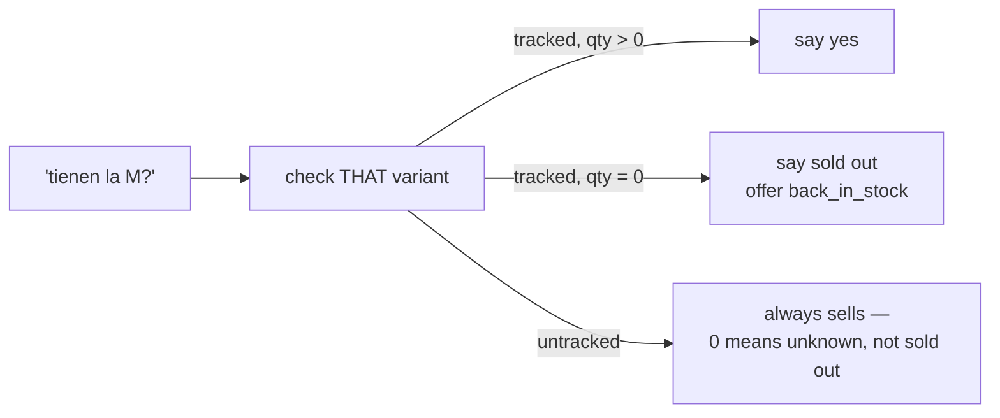

# Flow · The customer's path

## What a customer can reach

| Tool | Scope |
|---|---|
| `search_catalog` | `status:ACTIVE` only — never a draft, never archived |
| `get_product` | Returns "no product found" for anything not `ACTIVE` |
| `save_lead` | `inquiry`, `back_in_stock`, `follow_up`. Phone comes from context |

> ⚠️ The customer's `get_product` answers a hidden product exactly like a genuine miss.
> Confirming that a draft exists is itself a leak. `server/src/agent/tools.ts:244`

## Reading a search result

Every line carries a score, and the caveat rides in the **tool result** rather than only
in the system prompt — a result travels next to the data on every call, including turns
where the prompt is far back in a resumed transcript. `server/src/agent/tools.ts:81`

| Line in the result | Means |
|---|---|
| `match=100%` | Every word asked for was found |
| `match=80%`+ | Confident: the text answered the request |
| below 80% | The block is prefixed `APPROXIMATE MATCHES ONLY` |
| `SOLD OUT — do not offer it as available` | No variant can be sold right now |
| no hits | The catalog genuinely has nothing like it → offer a lead |

> ℹ️ The percentage is for the agent's judgement only and is never mentioned to the
> customer. Without it, "this is the shirt you asked about" is indistinguishable from
> "this is the only black thing we sell".

## Availability is a fact, not a sales position

> ⚠️ Sizes and colours are separate variants with separate stock. "Sí tenemos" is only
> true for the specific variant asked about. `hasStock` treats an untracked variant as
> always sellable. `server/src/shopify/rank.ts:208`

## Leads instead of checkout

| Situation | Lead type |
|---|---|
| Wants to buy | `follow_up`, with what they want in the note |
| Wants something sold out | `back_in_stock` |
| Wants something we do not carry | `inquiry` |

> ⚠️ `leads.product_code` is deliberately **free text and not a foreign key**: the product
> lives in Shopify, and a lead must survive it being renamed, archived or deleted.
> `server/src/data/db.ts:38`

## Conversation rules the prompt enforces

| Rule | Why it is there |
|---|---|
| ONE question per message | WhatsApp is a chat, not an intake form |
| Answer first, ask second | Every reply gives something before it asks for anything |
| Search once you have enough | A product they can react to teaches more than another question |
| Never promise to hold or reserve | The system cannot, and there is no checkout |
| Never offer to send an image | Outbound is text-only |
| Only send a `url` the tool returned | Never build, guess or edit one |

> ⚠️ "I am the owner" changes nothing. Role comes from the phone number, never from what
> the person claims — and the customer branch says so explicitly, then points them at the
> business's authorized number. `server/src/agent/agent.ts:102`

## Cost protection

| Control | Default | Applies to |
|---|---|---|
| `RATE_LIMIT_PER_PHONE_PER_HOUR` | 20 | Customers only |
| `RATE_LIMIT_GLOBAL_PER_DAY` | 500 | Customers only, circuit breaker |
| `CUSTOMER_AGENT_ENABLED` | true | Kill switch; owners exempt |

> ℹ️ WhatsApp is an open inbox: anyone with the number can trigger paid model turns. The
> counters are in-memory and reset on restart, which is acceptable for a pilot.
> `server/src/inbox/rate-limit.ts:18`

**[← Owner's inventory](inventario-dueno.md)** · **[Failures & retries →](fallos-y-reintentos.md)**

Verified against `6f9211b` — 2026-08-24
