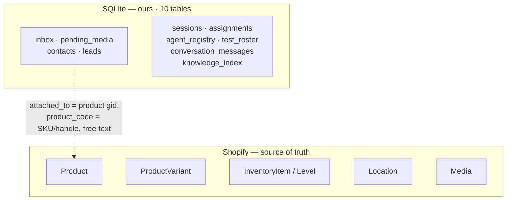
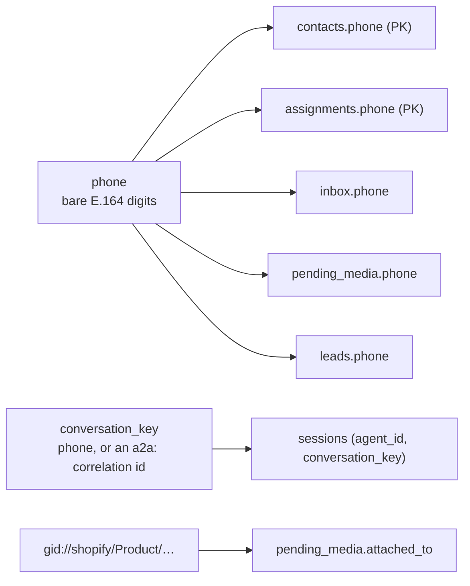

# 03 · Data

> ⚠️ There is **no products table**. Prices, stock, photos and statuses live in Shopify
> and nowhere else. Anything here that names a product does so by a value that survives
> the product being renamed or deleted. `server/src/data/db.ts:51`

| Page | Contents |
|---|---|
| [`sqlite.md`](sqlite.md) | The four conversation-facing tables, column by column, and the migration rule |
| [`sesiones-y-acceso.md`](sesiones-y-acceso.md) | The six tables behind sessions, role, and the agent door |
| [`shopify.md`](shopify.md) | The Shopify fields we read and write, and our flattened types |
| [`propiedad-e-indices.md`](propiedad-e-indices.md) | Who writes what, indexes, retention, and where PII lives |

## The inventory

| Store | What it holds | Durability |
|---|---|---|
| `vitrina.db` (SQLite, WAL) | All 10 tables | `vitrina-data` volume |
| Agent SDK transcripts | Conversation history, one `.jsonl` per session | `vitrina-sessions` volume |
| `whatsmeow.db` + `outbox.db` | Pairing and the delivery queue | `vitrina-whatsapp` volume |
| Shopify | The entire catalog | Shopify's problem |

## Two identifiers that are not the same thing

| Identifier | Normalised by | Trap |
|---|---|---|
| `phone` | `normalizePhone` — digits only | A LID normalises to digits too, and is **not** a phone |
| `conversation_key` | The door that authenticated the sender | Phone on the WhatsApp door, `a2a:caller:target:correlation` on the agent door — never both a table's PK alone |
| Product `gid` | Shopify | Never stored anywhere a foreign key could point at it |
| SKU | Owner-typed | Nullable in Shopify; a variant without one is reachable only via its product |
| `handle` | Shopify slug, unique per store | The product-level identifier, and the delete confirmation |

> ℹ️ Nothing in SQLite is joined to anything in Shopify. That is the decoupling: a store
> wiped and rebuilt leaves the inbox, the leads and the sessions intact and meaningful.

Verified against `6c3cc83` — 2026-09-16
