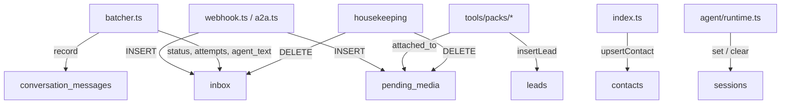

# Ownership, retention and PII

## Who writes what

| Column | Written by | Never written by |
|---|---|---|
| `inbox.status`, `inbox.attempts` | `batcher.ts` via `repo.ts` | Anything else — the state machine is one module's |
| `inbox.agent_text` | `webhook.ts` / `a2a.ts` at insert, `batcher.ts` on transcription | Tools |
| `inbox.audio_path` | `webhook.ts` sets it, `setInboxTranscript` clears it | Anything that does not also write the transcript |
| `sessions.agent_session_id` | `runAgentTurn`, **after** the turn | A tool mid-turn — it would be clobbered |
| `contacts.role` | `index.ts` `onMessage` (read from `roleFor`) | Never read for access decisions — the `assignments` table decides that |
| `assignments.role` | The `role-assignments` ops entry point, plus the boot seed from `OWNER_PHONE_NUMBERS` | The router, which only reads it |
| `conversation_messages` | `recordInboundMessages` (after resolve, before the turn), `recordOutboundMessage` (only after a successful send) | Anything that has not actually delivered |
| `pending_media.attached_to` | `attach_pending_photos`, only for ids that landed | The listing query, which claims nothing |
| `leads.*` | `save_lead` only | The owner path |

> ⚠️ `sessions.agent_session_id` and the transcript on disk have **split ownership**:
> SQLite is written by `agent/runtime.ts`, the file by the SDK subprocess. Keeping them
> consistent is what `sweepOrphanedTranscripts` is for. `server/src/data/transcripts.ts:79`

## Retention

| Data | Kept | Deleted by |
|---|---|---|
| `inbox` done | 7 days | `deleteStaleInboxRows`, hourly |
| `inbox` failed | 30 days | same — longer, for diagnosis |
| `pending_media` unattached + file | 48 hours | `deleteStalePendingMedia`, hourly |
| `pending_media` attached | Forever | Nothing. It records a real upload |
| Staged media in `/data/inbound` | 24 hours if orphaned | `sweepStagedMedia`, hourly |
| Voice-note audio | Until transcribed, then unlinked immediately | `batcher.resolveAudio` |
| Agent transcripts | `SESSION_MAX_AGE_DAYS` past their last touch, once unreferenced | `sweepOrphanedTranscripts` |
| `conversation_messages` | **No sweep on a timer** — not a decision made yet | `deleteConversationMessages`, only via `purge-sessions` |
| `contacts`, `leads`, `sessions`, `assignments`, `agent_registry`, `test_roster` rows | Forever | `purge-sessions` (customer sessions and their `conversation_messages` only) |

> ⚠️ The transcript sweep's age check is **not** redundant — it closes a race.
> `runAgentTurn` persists the id only after the turn, so mid-turn a live transcript exists
> that no row references yet. `server/src/data/transcripts.ts:77`

## Personal data

| Where | What | Exposure |
|---|---|---|
| `contacts`, `leads`, `inbox`, `sessions`, `conversation_messages` | Phone numbers, names, message text | Volume only. Never served |
| Transcripts | Full conversation history | Volume only |
| `MEDIA_DIR` | Owner product photos | **Public** at `PUBLIC_BASE_URL/media/<name>` |
| `AUDIO_DIR` | Voice notes awaiting transcription | Never routed, deleted after transcription |

> ⚠️ `AUDIO_DIR` is deliberately **not** `MEDIA_DIR`. That directory is served publicly, and
> a customer's voice note is private speech — publishing it at a guessable URL because it
> shared a code path with product photos would be a real leak. `server/src/whatsapp/media.ts:48`

> ℹ️ Audio is unlinked whether or not the words were recovered: clearing `audio_path`
> already made the file unreachable, so keeping it would leak one file per failed voice
> note. Someone's speech is also not something to hoard. `server/src/inbox/batcher.ts:304`

## Indexes

Six, and every one of them serves a query on the hot path — nothing here is indexed
speculatively. `server/src/data/db.ts:398-417`, `:478`

| Index | Serves |
|---|---|
| `idx_inbox_status` | `listReplayableInbox` on boot |
| `idx_inbox_conversation_status` | `claimInboxBatch` — every flush, by BOTH doors' `conversation_key` |
| `idx_inbox_phone_status` | Kept for "everything this phone ever sent"; no longer what the claim uses |
| `idx_leads_created_at` | `listLeads(since_days)` |
| `idx_pending_media_phone` | `listPendingMedia` — a phone's gallery, on every owner turn |
| `idx_conversation_messages_key` | Reading, deleting, and any future retention sweep of one conversation — all three narrow by `(conversation_key, occurred_at, id)` |

## Backups

`data/backup.ts` uses SQLite's online backup API — safe while the server is writing, unlike
copying the file. `server/src/data/backup.ts:36`

| Setting | Default |
|---|---|
| `BACKUP_DIR` | `./data/backups` |
| `BACKUP_KEEP` | 14 snapshots |
| Naming | `vitrina-YYYYMMDD-HHMMSS.db`, sorts lexicographically by age |

> ⚠️ A backup covers `vitrina.db` **only**. It does not cover the WhatsApp pairing, the
> transcripts, or the media files — and losing `vitrina-whatsapp` means re-pairing the
> number by hand.

**[← Shopify's side](shopify.md)** · **[Sessions & access](sesiones-y-acceso.md)** ·
**[Registered debt →](../DEUDA.md)**

Verified against `6c3cc83` — 2026-09-16
