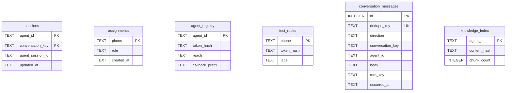

# SQLite — sessions, access, and the durable conversation record

Six of the **ten** tables. The other four — `inbox`, `pending_media`, `contacts`, `leads`
— are the ones a WhatsApp conversation actually writes, and live on
[`sqlite.md`](sqlite.md).

## `sessions` — keyed by agent AND conversation, not by phone alone

One resumable transcript per **(agent, conversation)** pair, not per phone: one person can
hold a conversation with more than one agent, and sharing a session id between them would
resume the wrong transcript into the wrong persona.

`conversation_key` is the phone for a WhatsApp principal and a correlation id for an
agent-to-agent exchange. `server/src/data/db.ts:83`

> ⚠️ A database created before this shape existed is **rebuilt**, not migrated in place —
> `PRIMARY KEY` cannot be `ALTER`ed. `migrateSessionsKey` re-keys every row using
> `OWNER_PHONE_NUMBERS` as it stood then, because the `assignments` table does not exist
> yet at that point in boot. `server/src/data/db.ts:531-579` (see `migrateSessionsKey`)

## `assignments` — the role boundary itself

| Column | Notes |
|---|---|
| `phone` | `normalizePhone`'s output — bare digits, the same space the WhatsApp door produces |
| `role` | `CHECK (role IN ('owner','customer'))` |

`router.ts` reads this table **per message**, never caches it — a revoked owner loses
access from their next message, not their next deploy.

`OWNER_PHONE_NUMBERS` only seeds rows that do not exist yet, at boot; it stops being
authoritative for a phone the moment a row exists. `server/src/data/db.ts:327`

## `agent_registry` and `test_roster` — two doors, two tables on purpose

| Table | What it authenticates | Why separate |
|---|---|---|
| `agent_registry` | `POST /agents/:id/messages` — the agent-to-agent door | `token_hash`, `reach` (JSON array of agent ids this credential may call), `callback_prefix` |
| `test_roster` | The temporary owner/customer role-flip console | A shared table would let a console token answer at the agent door, and an agent-door token flip a role |

> ⚠️ Both store `token_hash`, never the token: this file is copied by `data/backup.ts`
> onto a volume, so a stored credential would sit in every copy of it. `server/src/data/db.ts:226-231`

`test_roster` is TEMPORARY by decision — see `docs/test-console.md`. `server/src/data/db.ts:250-262`

## `conversation_messages` — the durable record, distinct from the `inbox` queue

`inbox` is a work queue and settles rows `done` at 7 days; this table is the record and has
**no retention swept on a timer** — how long a conversation is kept is a business decision
not yet made. `server/src/data/db.ts:333-366`

| Column | Notes |
|---|---|
| `dedupe_key` | One `UNIQUE` column serves both directions — inbound mints it from the inbox row, outbound from `(conversationKey, turnKey, body)` |
| `agent_id` | **Required**, unlike `inbox.agent_id` — by the time a message is recorded, the target has been resolved |
| `source_inbox_id` | Deliberately **not a foreign key**: it is expected to outlive the `inbox` row it came from |

Written inbound by `recordInboundMessages` (after media/audio resolve, before the turn
runs) and outbound by `recordOutboundMessage` (only after a successful send — see
`egress/responder.ts`, `01-arquitectura/agente-y-sesiones.md`). `server/src/data/repo.ts:582`, `:649`

> ⚠️ `deleteConversationMessages` REQUIRES both `conversationKey` and `agentId`. One phone
> can hold a row under each agent, and an unscoped delete previously wiped one agent's
> messages while purging the other's session — the bug that made the scope mandatory.
> `server/src/data/repo.ts:746-758`

## `knowledge_index` — the one derived table

One row per agent (`agent_id` PK, `content_hash`, `chunk_count`), rebuilt from
`agents/<id>/knowledge/*.md` at every boot and short-circuited by the hash so an unchanged
deployment writes nothing. `server/src/data/db.ts:199-217`

The chunks live in the FTS5 virtual table `knowledge_chunks` — full search behaviour on
[`base-conocimiento.md`](../01-arquitectura/base-conocimiento.md).

**[← Shopify's side](shopify.md)** · **[The other four tables →](sqlite.md)** · **[Ownership & retention →](propiedad-e-indices.md)**

Verified against `6c3cc83` — 2026-09-16
