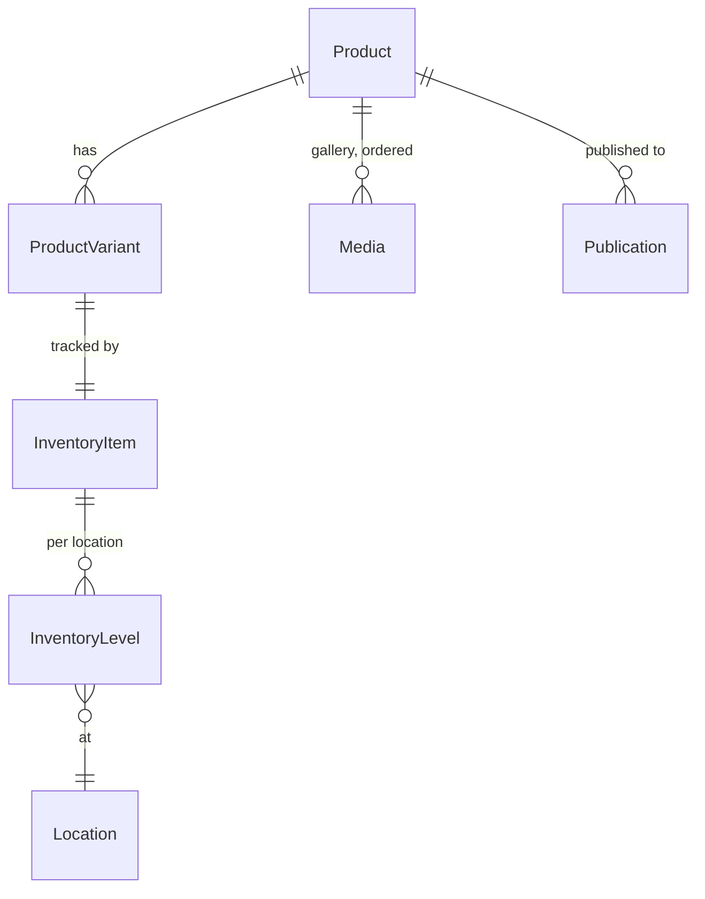

# Shopify — what we read and write

Every read goes through one GraphQL fragment, so a product looks the same coming back from
a search, a resolve, or a mutation. `server/src/shopify/catalog.ts:27`

> ℹ️ A tool that reported fewer fields after a write than before one would teach the agent
> that updating a product loses data.

## The fields we read

| Our field | Shopify | Notes |
|---|---|---|
| `id` | `id` | `gid://shopify/Product/…` |
| `handle` | `handle` | Unique per store. The product-level identifier |
| `title`, `description` | `title`, `description` | Plain text, **not** the HTML body |
| `status` | `status` | `ACTIVE` \| `DRAFT` \| `ARCHIVED` |
| `productType`, `vendor`, `tags` | same | Empty string / empty array when absent |
| `totalInventory` | `totalInventory` | `null` when nothing is tracked |
| `onlineStoreUrl` | `onlineStoreUrl` | Present **only** once published to the Online Store |
| `mediaCount` | `mediaCount.count` | A count, never the images themselves |
| `variants` | `variants(first: 100).nodes` | Flattened out of the connection |

| Variant field | Shopify | Notes |
|---|---|---|
| `sku` | `sku` | Nullable, and blank is normalised to `null` |
| `price` | `price` | **Decimal string, passed through verbatim** |
| `inventoryQuantity` | `inventoryQuantity` | Meaningless when `inventoryTracked` is false |
| `inventoryItemId` | `inventoryItem.id` | What every stock mutation addresses |
| `inventoryTracked` | `inventoryItem.tracked` | False means the variant always sells |
| `selectedOptions` | `selectedOptions` | `[{name: "Talla", value: "M"}]` — the ranker reads the **values** |

> ⚠️ Money never round-trips through a float. `ShopifyVariant.price` is a string precisely
> so no stored price can be rebuilt from one. `server/src/shopify/types.ts:26`

## The mutations we send

| Operation | Mutation | Shape |
|---|---|---|
| Create a product | `productCreate` | Then `productVariantsBulkCreate` for options |
| Add variants | `productVariantsBulkCreate` | `REMOVE_STANDALONE_VARIANT` on first use |
| Edit product fields | `productUpdate` | **Merge** — only keys present are sent |
| Edit price / SKU | `productVariantsBulkUpdate` | Omitted fields untouched |
| Delete | `productDelete` | Permanent |
| Publish | `publishablePublish` | Preceded by resolving the Online Store publication |
| Stock, absolute | `inventorySetQuantities` | With `compareQuantity` |
| Stock, movement | `inventoryAdjustQuantities` | With `@idempotent(key:)` |
| Photos | `stagedUploadsCreate` → POST → `productCreateMedia` | One file at a time |

> ⚠️ `assertNoUserErrors` must be called on **every** payload above. Shopify reports
> business-rule rejection inside a 200 OK body. `server/src/shopify/client.ts:173`

> ⚠️ `createProduct` avoids `productSet` on purpose: `productSet` deletes variants absent
> from the input. `server/src/shopify/catalog.ts:458`

## Escaping the query language

`products(query:)` is its own little language. An unescaped quote in an owner-supplied SKU
does not error — it silently changes which products are selected.
`server/src/shopify/catalog.ts:122`

> ⚠️ For a tool that can delete, "silently selects something else" is the difference
> between removing one product and removing the wrong one.

## Version and location

| Setting | Default | Why it is explicit |
|---|---|---|
| `SHOPIFY_API_VERSION` | `2026-01` | Shopify ships quarterly and deprecates on a rolling schedule. A silently-moving API is a silently-changing agent |
| `SHOPIFY_LOCATION_ID` | empty | With one location set, the agent never has to ask. Empty + several locations → `resolveLocation` throws |

> ℹ️ `resolveLocation` resolves a single-location store silently and refuses to guess in a
> multi-location one: moving four shirts out of the wrong warehouse is an error nobody
> notices until a count. `server/src/shopify/catalog.ts:284`

## Limits we live inside

| Limit | Handling |
|---|---|
| Calculated query cost (leaky bucket) | 4 attempts, exponential backoff, honours `Retry-After` |
| 250-product fetch ceiling | `truncated: true`, and every caller says so in its own output |
| 100 variants per product | Read in one page; a product past that is silently short |
| 30 s request timeout | `AbortSignal.timeout`, `server/src/shopify/client.ts:46` |

**[← SQLite](sqlite.md)** · **[Ownership & retention →](propiedad-e-indices.md)**

Verified against `6f9211b` — 2026-08-24
