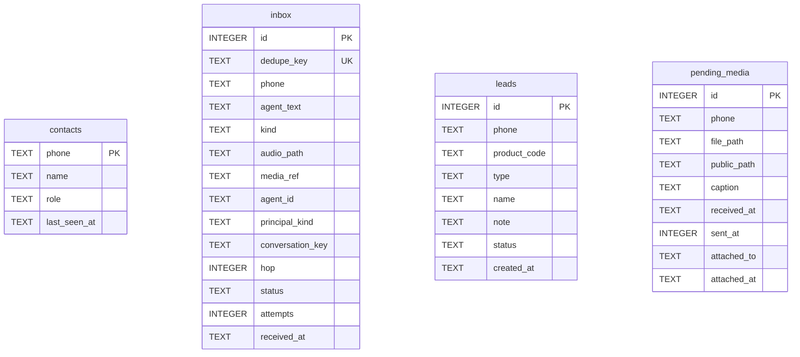

# SQLite — the customer-facing tables

Four of the **ten** tables this database holds. `sessions`, `assignments`,
`agent_registry`, `test_roster`, `conversation_messages` and the knowledge index are about
who is talking and what the agent knows, not a conversation's own content.

They live on [`sesiones-y-acceso.md`](sesiones-y-acceso.md).

Opened with `journal_mode = WAL` and `foreign_keys = ON`; the schema is created and
migrated on every boot. `server/src/data/db.ts:40`

## `inbox` — the durable queue, and the envelope for BOTH doors

| Column | Notes |
|---|---|
| `dedupe_key` | `UNIQUE`. `msg:<whatsapp id>` or `evt:<sha256>` on the WhatsApp door, per `messageId` on the agent door |
| `kind` | `text` \| `media`. **Persisted, never re-derived** — a photo's caption is its text |
| `audio_path` | Bytes on our disk awaiting transcription — a **different** state from `media_ref`, which means not fetched at all |
| `media_ref` | A file the transport holds that we have **not fetched yet** — a Meta media id, or a bridge staging path. With `media_kind` (`photo` \| `audio`), `media_mime`, `media_name` and `media_sent_at` it is everything `resolveMedia` needs |
| `agent_id` | Which assistant must answer. **NULL on a WhatsApp row on purpose** — the phone's target agent is resolved once per flushed burst, not per row |
| `principal_kind` / `principal_id` | `whatsapp` + the phone, or `agent` + the calling agent's id as its credential identified it — never anything the message claimed about itself |
| `conversation_key` | What `claimInboxBatch` claims by: the phone on the WhatsApp door, an `a2a:<caller>:<target>:<correlation>` key on the agent door |
| `reply_to` | A callback URL for a caller that cannot take the reply in its own response body. NULL means "answer whoever asked, the way that door answers" |
| `hop` | Agent-to-agent hop count; `0` on a WhatsApp row |
| `status` | `pending` \| `processing` \| `done` \| `failed` |
| `attempts` | Incremented at claim time, so the cap survives a restart |

`server/src/data/db.ts:94`

> ⚠️ Audio rows are deliberately `kind='text'`, not `'media'`. A transcript is a spoken
> line, not a caption under a photo count — and the media window would make one voice note
> wait 45 s for a reply. `server/src/data/db.ts:101`

## `pending_media` — photos on their way to a product

| Column | Notes |
|---|---|
| `file_path` | Absolute path under `MEDIA_DIR` |
| `public_path` | `PUBLIC_BASE_URL/media/<name>` — served by `registerMediaRoutes` |
| `sent_at` | WhatsApp's send stamp. Leads the gallery ordering; arrival order only breaks ties |
| `attached_to` | The Shopify product **gid**, set only after the upload succeeded |

> ⚠️ `attached_to` is a gid rather than a local id because the product is not ours:
> nothing here can reference it, and the column's only job is to keep the housekeeping
> sweep from deleting a file that already reached the store. `server/src/data/db.ts:165`

## `contacts`, `leads`

| Table | Key fact |
|---|---|
| `contacts` | `role` records what we **last saw**, never what decides access — that is the `assignments` table, `sesiones-y-acceso.md` |
| `leads` | `type` is checked in SQL: `inquiry` \| `back_in_stock` \| `follow_up` |

## Migrations

`CREATE TABLE IF NOT EXISTS` never alters an existing table, so every column added after
the pilot shipped is applied by an idempotent `addColumn` step on every boot. `server/src/data/db.ts:431`

| Step | Added when |
|---|---|
| `inbox.kind` | A captioned photo turned out to be indistinguishable from chat |
| `inbox.audio_path` | Voice notes |
| `inbox.media_ref` + companions, `pending_media.sent_at` | The Cloud API cut-over: the file fetch moved onto the worker, and Meta gives no delivery-order guarantee where photo order is listing order, `server/src/data/db.ts:443` |
| `pending_media.attached_to` / `attached_at` | The Shopify cut-over — it used to point at a local products row |
| `inbox.agent_id`, `principal_kind`, `principal_id`, `conversation_key`, `reply_to`, `hop` | The agent-to-agent door: one inbox, two doors, `server/src/data/db.ts:465` |

> ⚠️ SQLite cannot widen an existing `CHECK` with `ALTER TABLE`. That is why audio rides
> on `kind='text'` plus a nullable column rather than forcing a table rebuild on the
> running pilot. `server/src/data/db.ts:436`

**[Shopify's side →](shopify.md)** · **[Sessions & access →](sesiones-y-acceso.md)** · **[Ownership & retention →](propiedad-e-indices.md)**

Verified against `6c3cc83` — 2026-09-16
