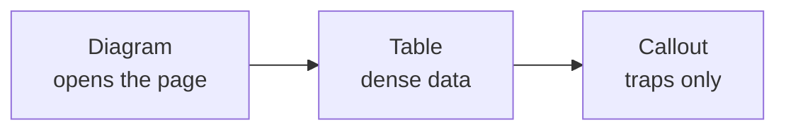
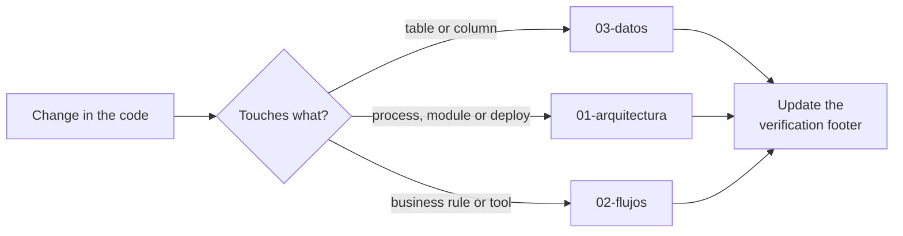

# Conventions



## Rules

| Rule | Detail |
|---|---|
| Diagram first | Every page opens with a diagram, never with a paragraph |
| No colors | No `fill:`, `stroke:`, `style`, `classDef` or `%%{init}%%` — GitHub renders light AND dark |
| ≤ 15 nodes | A diagram past that gets split in two |
| Table for the dense parts | Fields, tools, states, env vars: always a table |
| Prose only in a callout | `> ⚠️` or `> ℹ️`, three lines maximum, for a trap or a why |
| No filler | No "introduction", "context" or "summary" sections |
| ≤ 120 lines | Per page. If it grows, it splits |
| Anchored to code | Every non-obvious claim: `path/file.ts:line` |
| Verification footer | The commit the page was checked against |

## English, not Spanish

Docs, code, comments and prompt *instructions* are English. Only the agent's **replies**
and the user-facing strings it sends are Spanish. This is the repo-wide rule from
`CLAUDE.md`, and the wiki does not get an exception.

## Which diagram

| Intent | Type |
|---|---|
| Topology, dependencies, decisions | `graph` / `flowchart` |
| Ordering between actors over time | `sequenceDiagram` |
| An entity's lifecycle | `stateDiagram-v2` |
| Relations between tables | `erDiagram` |

## What does NOT go here

| Out of scope | Where it lives |
|---|---|
| Deployment runbooks | [`coolify-deploy.md`](coolify-deploy.md), [`secrets-management.md`](secrets-management.md) |
| The Shopify cut-over rationale | [`shopify-adaptation.md`](shopify-adaptation.md) |
| Provider-swap measurements | [`provider-swap-findings.md`](provider-swap-findings.md) |
| Instructions for coding agents | `CLAUDE.md` at the repo root |
| Anything not built | Keep it in a proposal file, and say so in its first line |

## Before committing

```bash
npm run docs:check
```

Validates fences, hardcoded colors, relative links, page length, prose density, and that
every `file:line` citation resolves to a real file with that many lines.

> ⚠️ What it **cannot** validate — that the diagrams render on GitHub in both themes —
> is checked by eye, and it is the part that matters most.

> ℹ️ The style checks (colors, length, prose density) run on the wiki pages only. The
> runbooks and proposals under `docs/` predate these conventions and are listed as exempt
> in `scripts/check-docs.sh` — exempted, never silently skipped.

> ℹ️ If `npm run test -w server` dies with `ERR_MODULE_NOT_FOUND … .bin/dist/cli.js`, the
> npm bin shims in this checkout are plain files, not symlinks. Run
> `cd server && node ../node_modules/vitest/vitest.mjs run` instead.

> ⚠️ The script must stay POSIX-ish bash. macOS ships bash 3.2, so no `mapfile`,
> no associative arrays, no `${var,,}`. A check nobody can run is not a check.

## Keeping it current



> ⚠️ Docs kept apart from the code go stale. Verifying against the code — re-counting
> the tools, re-reading the line a citation points at — is the only thing that separates
> documentation from folklore.

Commits: conventional commits with the axis as scope. `docs(datos): ...`,
`docs(flujos): ...`, `docs(arquitectura): ...`.

<sub>Verified against `6f9211b` — 2026-08-24</sub>
