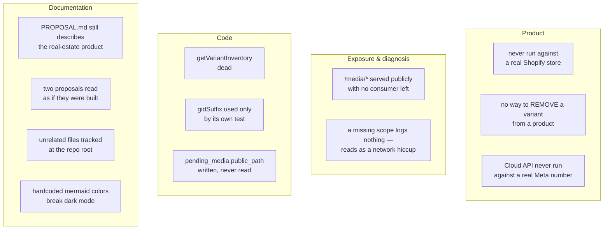

# Registered debt

Findings verified against the code that this wiki does not resolve, but somebody has to.

## Product

| # | Debt | Evidence | Impact |
|---|---|---|---|
| 1 | **The Shopify integration has never touched a real store.** Every Shopify test drives a fake `fetch` and asserts on recorded calls. The `test/live/` suite is LLM-provider parity — it says nothing about Shopify | `grep -rl SHOPIFY server/test/` returns only `agent.test.ts` and `config.test.ts`, neither of them live; `server/vitest.live.config.ts:16` | **High** |
| 1b | **The Cloud API transport has never carried a real message.** Every test drives a fake `fetch` and asserts on recorded calls, and `scripts/simulate-cloud-inbound.sh` fires locally signed payloads — neither reaches Meta. Untested for real: the panel handshake, the app-secret signature over Meta's exact bytes, media-id resolution, and the 24h window | `server/test/cloud-*.test.ts` inject `fetchImpl`; `WHATSAPP_PROVIDER` still defaults to `bridge`, `server/src/config.ts:296` | **High** |
| 2 | **An owner cannot REMOVE a variant from an existing product.** Adding is solved — `add_variant` exposes `addVariants` with guards for axis count, duplicate combinations and new option values. Removing one still means opening the Shopify admin | `server/src/shopify/catalog.ts:572`; no delete path below the product level | Medium |

> ⚠️ #1b is rehearsable and #1 is not: the simulate script exercises the whole inbound path
> without the number being registered, which is what makes the irreversible step — a number
> registered with Meta can no longer be used from the WhatsApp app — safe to practise first.

> ⚠️ #1 is the one that matters before a pilot. The suite proves we send the mutation we
> intend to send. It cannot prove Shopify accepts it, that the scopes are right, or that
> `@idempotent` behaves as documented.

## Exposure

| # | Debt | Evidence | Impact |
|---|---|---|---|
| 3a | **A missing Shopify scope is indistinguishable from a transient failure.** `publishToOnlineStore` catches and returns `false` without logging, and `uploadProductPhotos` counts a per-file `catch` as `failed` without logging. Both are correct not to throw — but with nothing in the log, a permissions problem reads to the owner as a network hiccup | `server/src/shopify/catalog.ts:735`, `:749`, `:848` | Medium |
| 3 | **`MEDIA_DIR` is served publicly at `/media/*` and nothing consumes it any more.** Photos reach Shopify by reading `file_path` off disk; the public URL is a leftover from the Next.js storefront that no longer exists. It exposes the owner's product photos for no benefit | `server/src/index.ts:126` registers the route; `publicPathFor` at `server/src/whatsapp/media.ts:8` has one caller, and its output is never read back | Medium |

## Code

| # | Debt | Evidence | Impact |
|---|---|---|---|
| 4 | `getVariantInventory` has zero callers and zero tests. Its return type `VariantInventory` exists only to serve it | `server/src/shopify/catalog.ts:345`, `server/src/shopify/types.ts:72` | Low |
| 5 | `gidSuffix` is used only by its own test — no production caller | `server/src/shopify/client.ts:182` | Low |
| 6 | `pending_media.public_path` is written on insert and selected by `listPendingMedia`, then never read. Pairs with #3 | `server/src/data/repo.ts:351`, consumer at `server/src/agent/tools.ts:608` | Low |

## Documentation

| # | Debt | Evidence | Impact |
|---|---|---|---|
| 7 | **`PROPOSAL.md` still describes the real-estate product** — a generated storefront, visit scheduling, "First vertical: real estate" — with no marker saying it is historical. It sits next to `README.md`, so it is among the first files a newcomer opens | `PROPOSAL.md:1-6` | Medium |
| 8 | **`docs/agent-roles-routing.md` and `docs/agent-catalog-decoupling.md` read as descriptions of the system.** Neither is built: there is no router and no agent registry anywhere in `server/src` | No match for a router or registry in `server/src`; this wiki's `README.md` is currently the only place that says so | Medium |
| 9 | `cryptography_concepts.md` (scratch notes) and `preview-0195.png` (855 KB storefront screenshot) are tracked at the repo root and belong to neither the product nor the docs | `git ls-files` | Low |
| 10 | **12 Mermaid `classDef` lines hardcode `fill:`/`stroke:`/`color:` in the two proposal docs.** GitHub renders in light *and* dark; a fixed palette breaks one of them. They are exempted from the style checks, not fixed | `bash scripts/check-docs.sh` with `is_wiki` removed; `docs/agent-roles-routing.md:43`, `docs/agent-catalog-decoupling.md:27` | Low |

> ℹ️ #7 and #8 are the same failure in two shapes: a document that was true once, or was
> only ever a plan, reads exactly like a document that is true now. A dated status line in
> the first three lines of each file fixes both.

## Not debt — deliberate

| Decision | Why it stays |
|---|---|
| No checkout | Milestone 1 is inventory. The customer path captures a lead instead |
| Rate-limit counters in memory | Single-process pilot; resetting on restart is acceptable |
| No backoff escalation on batch retries | Two retries ever — escalation buys nothing |
| `RETRY_DELAY_MS` is a constant, not config | Not worth an env var's surface for a pilot |
| The cache has no write-back or reconciliation | It is a ranking corpus, not a mirror |
| `pending_media.sent_at` has second resolution | Two photos shot inside one second fall back to arrival order — the finer stamp does not exist in Meta's payload |
| A failed media download is not retried | The message still gets its answer; a dead fetch re-attempted per attempt only makes the person wait longer |
| `env.anthropic` / `env.deepseek` tracked | Routing config only, no secrets — checked |

Verified against `196fd9b` — 2026-08-28
