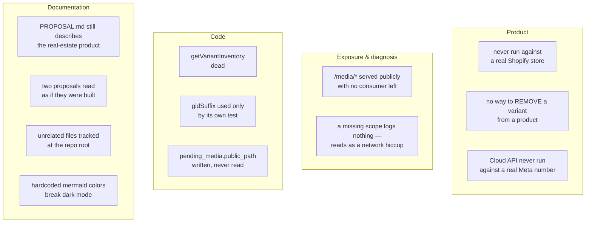

# Registered debt

Findings verified against the code that this wiki does not resolve, but somebody has to.

## Product

| # | Debt | Evidence | Impact |
|---|---|---|---|
| 1 | **The Shopify integration has never touched a real store.** Every Shopify test drives a fake `fetch` and asserts on recorded calls. The `test/live/` suite is LLM-provider parity — it says nothing about Shopify | `grep -rl SHOPIFY server/test/` returns only `agent.test.ts` and `config.test.ts`, neither of them live; `server/vitest.live.config.ts:16` | **High** |
| 1b | **The Cloud API transport has never carried a real message.** Every test drives a fake `fetch` and asserts on recorded calls, and `scripts/simulate-cloud-inbound.sh` fires locally signed payloads — neither reaches Meta. Untested for real: the panel handshake, the app-secret signature over Meta's exact bytes, media-id resolution, and the 24h window | `server/test/cloud-*.test.ts` inject `fetchImpl`; `WHATSAPP_PROVIDER` still defaults to `bridge`, `server/src/config.ts:296` | **High** |
| 2 | **An owner cannot REMOVE a variant from an existing product.** Adding is solved — `add_variant` exposes `addVariants` with guards for axis count, duplicate combinations and new option values. Removing one still means opening the Shopify admin | `server/src/shopify/catalog.ts:572`; no delete path below the product level | Medium |

> ⚠️ #1b is rehearsable and #1 is not: the simulate script exercises the whole inbound path
> without the number being registered, which is what makes the irreversible step — a number
> registered with Meta can no longer be used from the WhatsApp app — safe to practise first.

> ⚠️ #1 is the one that matters before a pilot. The suite proves we send the mutation we
> intend to send. It cannot prove Shopify accepts it, that the scopes are right, or that
> `@idempotent` behaves as documented.

## Exposure

| # | Debt | Evidence | Impact |
|---|---|---|---|
| 3a | **A missing Shopify scope is indistinguishable from a transient failure.** `publishToOnlineStore` catches and returns `false` without logging, and `uploadProductPhotos` counts a per-file `catch` as `failed` without logging. Both are correct not to throw — but with nothing in the log, a permissions problem reads to the owner as a network hiccup | `server/src/shopify/catalog.ts:735`, `:749`, `:848` | Medium |
| 3 | **`MEDIA_DIR` is served publicly at `/media/*` and nothing consumes it any more.** Photos reach Shopify by reading `file_path` off disk; the public URL is a leftover from the Next.js storefront that no longer exists. It exposes the owner's product photos for no benefit | `server/src/index.ts:126` registers the route; `publicPathFor` at `server/src/whatsapp/media.ts:8` has one caller, and its output is never read back | Medium |

## Code

| # | Debt | Evidence | Impact |
|---|---|---|---|
| 4 | `getVariantInventory` has zero callers and zero tests. Its return type `VariantInventory` exists only to serve it | `server/src/shopify/catalog.ts:345`, `server/src/shopify/types.ts:72` | Low |
| 5 | `gidSuffix` is used only by its own test — no production caller | `server/src/shopify/client.ts:182` | Low |
| 6 | `pending_media.public_path` is written on insert and selected by `listPendingMedia`, then never read. Pairs with #3 | `server/src/data/repo.ts:351`, `server/src/data/repo.ts:467`, mapped but not used in `server/src/data/tool-ports.ts:40` | Low |
| 7 | **The conversation record is kept indefinitely — DECIDED, not pending.** The owner chose indefinite retention "por ahora" (2026-09-09) with the consequence stated: the tables only grow, and `data/backup.ts` copies the whole SQLite file, so every conversation ever held rides in every backup copy. **Raised in cost by `conversation_tool_calls`**, which takes ONE ROW PER TOOL CALL rather than per message — a normal owner turn is one message and several calls, and each row carries the tool's full result — so this table is what makes the decision bite first. It stays listed because the decision is provisional and because the stored words include the store's real CUSTOMERS — third parties to that decision, covered by Ley 1581, and now readable in one page through the admin console. Revisit when the tables are large enough to notice. Both indexes are ordered so a sweep-by-age is a query rather than a migration | `server/src/data/db.ts` (both table blocks state it), `server/src/data/repo.ts` sweeps only `inbox` | Medium (accepted) |
| 8 | ~~**A purge cannot reach the words of a conversation whose session row is gone.**~~ **CLOSED.** `listConversationKeysWithMessages` (the repo-layer enumeration whose absence kept this open) now drives a SECOND PASS in `purgeCustomerSessions`, applying the same three sparing predicates as the session loop — agent key, owner key, owner agent — to every (conversation_key, agent_id) pair that has messages, whether or not a session row still points at it. It deletes the tool trace alongside the words, and reports what it reached as `purgedOrphanPairs`. The test that pinned the gap now pins the closure, with two more covering the sparing direction | `server/src/data/purge.ts` (the second pass), `server/src/data/repo.ts` `listConversationKeysWithMessages`, `server/test/purge.test.ts` | — |
| 9 | ~~**System notices are sent but never recorded.**~~ **CLOSED.** The rate-limit notice, the customer kill-switch notice and the terminal-failure apology now go through the responder like every other reply, so all three reach `conversation_messages`. All three stay BEST-EFFORT (wrapped in their own try/catch) because their batches are deliberately consumed: retrying a whole burst to re-send a static notice would spend the attempt budget on a message carrying no answer. **Residual, deliberately not closed**: `OWNER_FAILURE_ALERT` is still unrecorded — it belongs to no turn and no conversation, so recording it would mean inventing a turn key, which is a new concept rather than a wiring fix. **No direct test**: the three call sites live inside `index.ts` `main()`, which exports nothing; the property they rely on (deliver records, a failed send records nothing) is pinned in `responder.test.ts` | `server/src/index.ts` (the three sites), `server/src/egress/responder.ts` | Low (residual) |
| 10 | **A crash between a successful send and its record loses that reply from the record.** The replay re-sends and records the new one, so the record shows one outbound where the person received two. Closing it needs the send and the write to be atomic, which no transport offers. It fails in the safe direction — the record under-counts deliveries, it never invents one | `server/src/egress/responder.ts` (`recordSafely`, called after the send resolves) | Low |
| 11 | **The test console is TEMPORARY and nothing enforces that but a person.** `test_roster`, `data/test-roster.ts`, `data/test-console-credentials.ts`, `admin/test-console.ts` and their tests exist only for the owner's manual test period. Deleting every roster row kills the surface immediately with no restart, because auth is a lookup in that table — but `CREATE TABLE IF NOT EXISTS` never dropped anything, so the table itself outlives the code unless a `DROP TABLE` is added to `migrate()` for one release. Full checklist in the runbook | `docs/test-console.md` (removal checklist), `server/src/data/db.ts` (`test_roster`) | Medium |
| 12 | **The console link is a bearer credential that will live in a WhatsApp chat, with no expiry and no second factor.** What a leaked link actually grants is narrower than it first reads, and the difference matters: the console's only write is `assignRole` on its OWN credential's phone, and role is resolved per message from the phone the TRANSPORT authenticated — so an interceptor cannot gain owner tools, because using them means sending WhatsApp messages from a phone they do not have. What they can do is flip the owner's phone to `customer` (denial of service until the owner flips back) and read metadata: the label, the masked phone, and whether each mode has a conversation. **Not** conversation content, and **not** `set_price` or `delete_product`. Real exposure, wrong shape to panic about. Mitigation is `rotate`, a short roster, and removal when the test period ends | `server/src/admin/test-console.ts` (single write), `server/src/inbox/batcher.ts` (role resolved from the authenticated phone) | Low |
| 13 | **`label` is operator-typed text whose HTML safety is a convention.** The roster stores it and the console page must render it with `textContent`; nothing mechanically prevents a later edit from interpolating it into markup. Low reach — only an operator with terminal access can write one — but it is the one field on that page that is not generated by us | `server/src/data/test-roster.ts` (the column comment), `server/src/admin/test-console.ts` (the render) | Low |
| 14 | **Two module cycles run through the tool registry.** `tools/registry.ts` reads the tool-name constants `ASK_AGENT_TOOL` and `SEARCH_KNOWLEDGE_TOOL` from `agent/definition.ts`, while `agent/runtime.ts` builds the tool server from the registry; and the registry registers `searchKnowledge` from `knowledge/tool.ts`, while that tool uses the registry's own `text` factory. Both are shallow — two constants and a helper — but they are real value cycles, so neither module can be read or moved alone. They were visible in the same import graph that found the three leaks closed in `ea3d2c1`, and were not closed with them. The likely fix is the same move: the tool-name constants and the `text` helper are vocabulary more than one layer owns | `server/src/tools/registry.ts:3`, `server/src/tools/registry.ts:4`, `server/src/agent/runtime.ts:7`, `server/src/knowledge/tool.ts:3` | Low |
| 15 | **Nothing records that an admin READ a conversation.** Writes are now attributed — every pause, release and sent message names the admin phone behind the session, and `conversation_handoff` keeps the history — but a READ leaves no trace at all: nothing says which session opened whose thread, or when. The risk is not tampering, it is that a leaked or over-shared link is undetectable after the fact, and what it reads is every customer's phone number and messages (Ley 1581, see #7). A `request.log.info` naming `session.phone` and the conversation key would close most of it, and must never include the token. Not done here because an audit trail with no retention policy is the same open question as #7 | `server/src/admin/console.ts` (the read routes log nothing; the write routes already log at WARN) | Medium |
| 16 | **A long conversation can only be read from its recent end.** `/admin/conversation` takes the most recent `MAX_THREAD_MESSAGES` (500) and reports `truncated: true`, and there is no way to page further back — the reader cannot reach the beginning of a conversation that exceeded it. `listConversationMessages` supports only a limit, not an offset or a cursor. With retention indefinite (#7) the ceiling is reachable in principle. Deliberately not built speculatively: a cursor over `(occurred_at, id)` is the shape when it is wanted, and the index already serves it | `server/src/admin/console.ts` `MAX_THREAD_MESSAGES`, `server/src/data/repo.ts` `listConversationMessages` | Low |
| 17 | **The conversation index cannot be searched.** Finding a conversation means knowing its phone number or paging the list; there is no search over stored words. `listConversations` deliberately takes no search parameter, because a `LIKE` over `body` would scan every stored word on every page load. The real shape is FTS5, exactly like the knowledge index already in this schema — which is why it was left out rather than bolted on | `server/src/data/repo.ts` `listConversations`, `server/src/data/db.ts` (`knowledge_chunks` is the FTS5 precedent) | Low |
| 18 | **A conversation can be left paused and forgotten, and nobody is answering it.** Releasing is manual by design — a timer that resumed the bot would do it mid-exchange, with the human mid-sentence — so the accepted failure is the opposite one: a conversation the assistant is silent for and the human moved on from. The customer's messages pile up recorded and unread, and BOTH ENDS ARE SILENT: the customer sees no reply, and nothing tells the admin they still hold it. **Widened deliberately**: every human intervention now pauses (taking a lead, sending a reply), so pauses happen far more often and most are no longer a deliberate act — the owner chose that trade to remove the confusion of a bot answering over a human, with this as the stated cost. Mitigated only by visibility: the index shows a banner naming how many are paused. There is no alert, no age threshold, and nothing reaches the admin who paused it. The likely fix is a notification once a handoff passes some age, which is a policy number nobody has chosen; an auto-release is NOT the fix, for the reason above | `server/src/admin/console.ts` (the send and lead-status routes pause; the index banner), `server/src/data/db.ts` (`conversation_handoff`, the no-auto-release note) | **High** |
| 19 | **The agent learns nothing from what a human said while holding the conversation.** Releasing drops the session so the agent does not resume a transcript that ends at the pause — the honest choice — but it means the next turn starts blank: the customer writes "como quedamos con Santiago" and the agent has no idea. The messages exist in `conversation_messages` and could be summarised into the next turn's prompt; that is a real feature, not a wiring fix, and building it speculatively would have shipped a summarisation path nobody had asked for | `server/src/admin/console.ts` (the release route explains the trade), `server/src/data/repo.ts` `listConversationMessages` | Medium |
| 20 | **The paused gate and the admin-link intercept have no direct test.** Both are a handful of lines inside `index.ts` `main()`, which exports nothing and runs on import, so a test cannot reach them — the same reason #9's three notice sites have none. Everything they depend on IS pinned: `isConversationPaused` and its agent scoping, `isAdminLinkRequest` including the substring cases it must refuse, session issue/claim/revoke. What is unverified is the WIRING — that the gate sits after the recording and before the turn, and the intercept before both gates. Closing it means extracting the handler from `main()`, which is a larger refactor than this slice | `server/src/index.ts` (`onMessage`), `server/src/admin/link-request.ts`, `server/test/admin-sessions.test.ts` | Medium |
| 21 | **An admin session is not bound to a device or an IP, so a link opened by the wrong person is indistinguishable from the right one.** The claim window bounds the exposure (minutes to open, then hours) and `admin-access revoke` ends it, but nothing detects the case: no user-agent pinning, no second factor, no "this session was already opened elsewhere" signal. Stated in the schema rather than papered over — the alternative designs (exchange-on-claim, device binding) each add a mechanism whose failure mode is locking the real owner out of their own store | `server/src/data/admin-sessions.ts` (the NOT SINGLE-USE paragraph) | Medium |
| 22 | **`OWNER_FAILURE_ALERT` and the lead notification are sent but never recorded.** Both are outbound messages an owner genuinely receives, and neither reaches `conversation_messages` — the residual half of #9. They belong to no turn and no conversation, so recording them means inventing a turn key, which is a new concept rather than a wiring fix. The lead notice makes it worse than it was: it now fires routinely AND is the one message that can arrive as a template, so an owner's thread in the console shows gaps exactly where the system was most active | `server/src/index.ts` (`notifyOwnersOfFailures`, `notifyOwnerOfLead`) | Low |
| 23 | **Every lead notification now carries a one-shot admin credential.** The template's button needs a landing code, so one is minted per owner per lead — meaning a WhatsApp chat full of lead notices is a chat full of credentials. Each is single use and dies in 24h, and the owner asked for exactly this (the button is the feature), but the posture changed: before, a notification carried nothing and the owner had to write "panel". What would actually close it is a SCOPED session — one that opens the named conversation and nothing else — which is a new permission model rather than a tweak, since every read route today authorises on "is this session live" alone | `server/src/index.ts` `notifyOwnerOfLead`, `server/src/data/admin-deep-links.ts`, `server/src/admin/console.ts` (every route authenticates the same way) | **High** |
| 24 | **`OWNER_FAILURE_ALERT` still has no template, so the outage alert dies in exactly the outage it reports.** The lead notice got one; this did not, because it needs its own approved template and nobody has submitted one. It fires when the assistant has failed several times running — precisely when an owner may not have written to the business number recently — so it is the alert most likely to be outside the 24h window and rejected with 131047, logged and never delivered. `sendTemplate` and the fallback shape already exist; what is missing is an approved template name to configure | `server/src/index.ts` `notifyOwnersOfFailures`, `docs/whatsapp-cloud-api.md` §8 | Medium |
| 25 | **From 1 October 2026, every lead notice costs money, once per owner.** Service messages inside the 24h window stop being free and utility templates become billable in-window too; the 1,000/month free allowance covers service messages only, not templates. The notifier loops `listPhonesWithRole(db, "owner")` and sends to each, so a store with three owners pays three times per lead. Nothing here is wrong — it is what "tell the owners" means — but it is now a per-lead cost that scales with the owner list, and no deployment has been asked whether that is what it wants | `server/src/index.ts` (the notifier loop), `docs/whatsapp-cloud-api.md` §8 | Medium |

## Documentation

| # | Debt | Evidence | Impact |
|---|---|---|---|
| 7 | **`PROPOSAL.md` still describes the real-estate product** — a generated storefront, visit scheduling, "First vertical: real estate" — with no marker saying it is historical. It sits next to `README.md`, so it is among the first files a newcomer opens | `PROPOSAL.md:1-6` | Medium |
| 8 | **`docs/agent-roles-routing.md` reads as a description of the system, and half of it is not built.** It describes a super-agent that orchestrates specialists and chains them for an admin role. What exists is narrower: agents CAN talk — the agent door authenticates callers against `agent_registry`, and `ask_agent` reaches another agent in process — but `ask_agent` is declared by neither shipped agent, so nothing orchestrates anything. Routing today is phone → role → agent, from the `assignments` table. The page carries no superseded or proposal banner. (`docs/agent-catalog-decoupling.md` was the other half of this entry; it is already marked superseded.) An earlier version of this row said no agent-to-agent routing existed at all, which stopped being true when the door landed | `server/src/inbox/a2a.ts:313`, `server/src/router.ts:97`; `ask_agent` absent from both `agents/*/agent.yaml` | Medium |
| 9 | `cryptography_concepts.md` (scratch notes) and `preview-0195.png` (855 KB storefront screenshot) are tracked at the repo root and belong to neither the product nor the docs | `git ls-files` | Low |
| 10 | **12 Mermaid `classDef` lines hardcode `fill:`/`stroke:`/`color:` in the two proposal docs.** GitHub renders in light *and* dark; a fixed palette breaks one of them. They are exempted from the style checks, not fixed | `bash scripts/check-docs.sh` with `is_wiki` removed; `docs/agent-roles-routing.md:43`, `docs/agent-catalog-decoupling.md:27` | Low |

> ℹ️ #7 and #8 are the same failure in two shapes: a document that was true once, or was
> only ever a plan, reads exactly like a document that is true now. A dated status line in
> the first three lines of each file fixes both.

## Not debt — deliberate

| Decision | Why it stays |
|---|---|
| No checkout **of our own** | `build_cart` hands over a Shopify cart permalink. We never take payment, quote shipping or reserve stock — Shopify is the merchant of record |
| Rate-limit counters in memory | Single-process pilot; resetting on restart is acceptable |
| No backoff escalation on batch retries | Two retries ever — escalation buys nothing |
| `RETRY_DELAY_MS` is a constant, not config | Not worth an env var's surface for a pilot |
| The cache has no write-back or reconciliation | It is a ranking corpus, not a mirror |
| `pending_media.sent_at` has second resolution | Two photos shot inside one second fall back to arrival order — the finer stamp does not exist in Meta's payload |
| A failed media download is not retried | The message still gets its answer; a dead fetch re-attempted per attempt only makes the person wait longer |
| `env.anthropic` / `env.deepseek` tracked | Routing config only, no secrets — checked |

Verified against `196fd9b` — 2026-08-28
