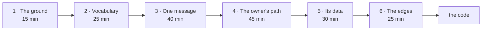

# Reading path — from the shape to the detail

For someone getting up to speed on Vitrina. About 3 hours across 6 sessions.

> ⚠️ **Do not read by axis, read by depth.** The wiki is in three axes because that is how
> it stays maintainable, **not** because that is the order it is learned. Go all the way
> down one path before opening the other two.

## 1 · The ground — 15 min

[`README.md`](README.md) → [`01-arquitectura/README.md`](01-arquitectura/README.md)

**Done when** you can draw the two processes, the three volumes, and which way each arrow
points — including which one is not disposable.

## 2 · The vocabulary — 25 min · **the important one**

[`03-datos/README.md`](03-datos/README.md) — the inventory only, do not open the leaves.

**Done when** you can say, without hedging, what lives in Shopify and what lives in
SQLite, and why nothing joins across that line.

> ⚠️ If "the catalog is Shopify" has not fully landed, everything after this reads as an
> arbitrary pile of modules. This is the step people skim and then never recover from.

## 3 · One message, end to end — 40 min

[`pipeline-mensajes.md`](01-arquitectura/pipeline-mensajes.md) →
[`mensaje-entrante.md`](02-flujos/mensaje-entrante.md)

It is the spine of the system: webhook → inbox row → debounce → per-phone queue → one
agent turn → reply.

**Done when** you can explain why the debounce is not in the HTTP handler, and why a
photo burst waits 45 seconds while chat waits 8.

## 4 · The owner's path — 45 min

[`inventario-dueno.md`](02-flujos/inventario-dueno.md) →
[`agente-y-sesiones.md`](01-arquitectura/agente-y-sesiones.md)

**Done when** you can answer all three:

| Question |
|---|
| Why is `set_to` preferred over `delta`, and what protects `delta` when it is used? |
| What does `status: ACTIVE` actually do, and what does it **not** do? |
| Why does publishing a product wipe the conversation? |

## 5 · The data behind it — 30 min

[`sqlite.md`](03-datos/sqlite.md) · [`shopify.md`](03-datos/shopify.md)

Now that you know the flow, the columns mean something. Before this they were a list.

**Done when** you can explain why a voice note is stored as `kind='text'`.

## 6 · The edges — 25 min

[`bridge-whatsapp.md`](01-arquitectura/bridge-whatsapp.md) ·
[`propiedad-e-indices.md`](03-datos/propiedad-e-indices.md) · [`DEUDA.md`](DEUDA.md)

These are the ones that stop you breaking something: how the transport can fail silently,
who writes which column, and what is already wrong on purpose.

**Done when** you can say what `loggedOut: true` means and why no restart fixes it.

## How to read a page

| Element | How to treat it |
|---|---|
| Diagram | Understand it before the table. If it does not stand alone, the diagram is wrong |
| Table | Reference. Do not memorise it — know it is there |
| `> ⚠️` | **Read it twice.** Each one is a day of debugging already paid for |
| `> ℹ️` | The reasoning behind a decision |
| `file.ts:line` | The real code. Open it whenever you doubt |

## And then

Pick **one** vertical slice and follow it in the code, not folders: an owner's photo from
`bridge/inbound.go`, through the staging volume and `pending_media`, into
`uploadProductPhotos` until it is a Shopify image.

> ℹ️ One path across both languages teaches more than five directories read end to end.

> ℹ️ Auditing the wiki instead of learning from it is a different goal and a different
> method: [`REVISION.md`](REVISION.md).

> ⚠️ This wiki is new. If something does not match the code, **the documentation may be
> wrong** — check the citation and fix it rather than assuming you misread.

**[← Home](README.md)**
