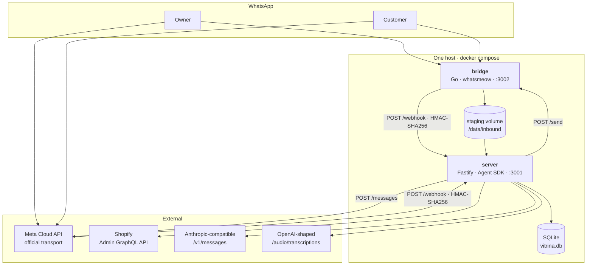
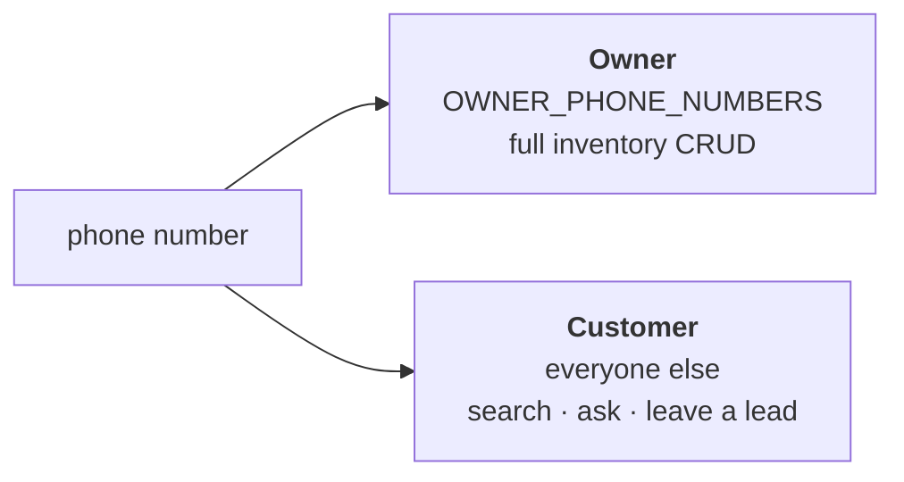

# Vitrina — Wiki

| Workspace | Language | Ships as | Responsibility |
|---|---|---|---|
| `server/` | TypeScript · ESM | npm workspace | Webhook, batching, agent turns, Shopify tools, SQLite |
| `bridge/` | Go | static binary, distroless image | WhatsApp transport. **Not** an npm workspace |

> ℹ️ **Two transports, one seam.** `WHATSAPP_PROVIDER=bridge\|cloud` picks between the
> linked-device sidecar and Meta's official Cloud API; both implement `WhatsAppChannel`,
> so the cut-over is one variable and a restart.

> ⚠️ **The catalog is Shopify.** There is no local products table, no storefront of
> our own, and no sync layer. SQLite holds only what Shopify has no place for.

---

## Sections

| | Section | Contents |
|---|---|---|
| 🏛 | **[01 · Architecture](01-arquitectura/)** | The two processes, the message pipeline, the Shopify layer, deployment |
| 🔀 | **[02 · Flows](02-flujos/)** | One message end to end, the owner's inventory path, the customer's path, failure |
| 🗄 | **[03 · Data](03-datos/)** | The five SQLite tables, the Shopify fields we read and write, who writes what |

**[🧭 Reading path](ONBOARDING.md)** · **[🔍 How to audit this](REVISION.md)** · **[⚠️ Registered debt](DEUDA.md)** · **[Conventions](CONTRIBUTING.md)**

---

## Two roles that never mix

> ⚠️ Role is decided by the phone number and **never** by what the person says.
> An owner tool reaching a customer is a stranger repricing a live store.

---

## Scope

This wiki covers **architecture, flows and data**. Milestone 1 is inventory: full CRUD
over products, variants, stock and photos. **There is no checkout** — the customer path
answers questions and captures leads.

What lives elsewhere in this repo, and stays there:

| Document | What it is |
|---|---|
| [`shopify-adaptation.md`](shopify-adaptation.md) | The reasoning behind the Shopify cut-over, written before the code |
| [`shopify-setup.md`](shopify-setup.md) | **Connecting the store**: custom app, scopes, token, verification |
| [`coolify-deploy.md`](coolify-deploy.md) · [`secrets-management.md`](secrets-management.md) · [`gopass-setup.md`](gopass-setup.md) | Deployment and secrets runbooks |
| [`provider-swap.md`](provider-swap.md) · [`provider-swap-findings.md`](provider-swap-findings.md) | Swapping the LLM provider, and what it measured |
| [`voice-notes.md`](voice-notes.md) | How voice notes are transcribed and what they cost |
| [`agent-roles-routing.md`](agent-roles-routing.md) · [`agent-catalog-decoupling.md`](agent-catalog-decoupling.md) | Forward-looking proposals, **not** built |

> ℹ️ `CLAUDE.md` at the repo root is the operating manual for coding agents. This wiki
> is the same system explained to a person; where they disagree, the code decides.

Verified against `36e95b2` — 2026-08-25
