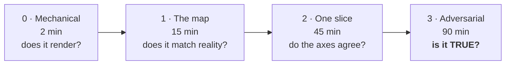

# How to audit this wiki



> ⚠️ **Reading top to bottom feels like inspection and is not.** Plausible prose reads
> well whether it is right or wrong. Level 3 is the only thing that separates
> documentation from folklore.

## Level 0 · Mechanical — 2 min

```bash
npm run docs:check
```

Checks fences, hardcoded colors, relative links, page length, prose density, and that
every `file:line` citation resolves to one real file with at least that many lines.

**Not automated:** open a few pages on GitHub and confirm the diagrams render, in light
and in dark. Mermaid syntax is not parsed — that would pull `mermaid` and `jsdom` into a
repo that needs neither.

## Level 1 · The map — 15 min

Read [`README.md`](README.md) and the three section READMEs. Then, **without looking
again**, answer:

| Question | If you cannot answer |
|---|---|
| How many processes, how many volumes, which one is not disposable? | The topology diagram fails |
| Who decides whether a phone is an owner, and where? | The role boundary is not communicated |
| Why is there no products table? | The central decision is not landing |
| How is `status: ACTIVE` different from published? | The most expensive trap is buried |

> ℹ️ This level tests the **diagrams**. If you had to read prose to answer, a diagram is
> not doing its job.

## Level 2 · One vertical slice — 45 min

Follow the owner listing a product across all three axes:
[flow](02-flujos/inventario-dueno.md) → [data](03-datos/shopify.md) →
[architecture](01-arquitectura/capa-shopify.md), hunting **contradictions between axes**.

| Contrast | Must agree with |
|---|---|
| Tools named in the flow | The tool table in [`agente-y-sesiones.md`](01-arquitectura/agente-y-sesiones.md) |
| Mutations named in the flow | The mutation table in [`shopify.md`](03-datos/shopify.md) |
| Columns named in a flow | [`sqlite.md`](03-datos/sqlite.md) and [`propiedad-e-indices.md`](03-datos/propiedad-e-indices.md) |

A contradiction between two pages means **at least one is wrong**. Write down which.

## Level 3 · Adversarial against the code — 90 min

The only level that tests whether this is **true**. Do not read to confirm; read to break.

### 3a · Counts — reproducible

```bash
grep -cE 'CREATE TABLE IF NOT EXISTS [a-z_]+ \(' server/src/data/db.ts
grep -c '= tool($' server/src/agent/tools.ts
grep -c '^export \(async \)\?function' server/src/shopify/catalog.ts
grep -oE '(query|mutation) [A-Z][A-Za-z]*' server/src/shopify/catalog.ts | sort -u | wc -l
```

| Claim | Value at `6f9211b` |
|---|---|
| SQLite tables | 5 |
| Tools registered | 12 — 3 customer, 9 owner-only |
| Exported functions in `catalog.ts` | 17 |
| Named GraphQL operations | 19 — 10 mutations, 9 queries |
| Server tests | 294 across 20 files |

> ⚠️ The table count needs the trailing ` \(`. Without it the regex also matches the
> sentence "CREATE TABLE IF NOT EXISTS never alters…" in the migration comment and reports
> **6**. This wiki made that mistake first.

### 3b · Where this wiki is most likely wrong

| # | Zone | Why it is fragile |
|---|---|---|
| 1 | **Line numbers in citations** | They move with every commit. The checker proves the file has that many lines, **not** that the line still says what is claimed |
| 2 | **Env var defaults** | Transcribed from `server/src/config.ts:257`. A default changed in code and not here reads as fact |
| 3 | **Shopify behaviour claims** | `@idempotent`, `compareQuantity`, `publishablePublish` are described from the code's comments, **not** from an observed response — see [`DEUDA.md`](DEUDA.md) #1 |
| 4 | **The tool tables** | Composed from `buildToolServer`'s two arrays. A tool added there and not here goes unnoticed |

### 3c · Refutation test

Pick five `⚠️` callouts and try to **refute** them. One that survives an honest attempt is
worth twenty read past.

| Claim | How to refute it |
|---|---|
| `status: ACTIVE` does not publish | Read `publishToOnlineStore` end to end, not just its comment |
| A customer cannot see a draft | Check **both** `get_product` branches in `tools.ts` |
| `tags` replaces the whole list | Read `updateProduct`'s spread — is `tags` merged anywhere? |
| The turn key is stable across retries | Follow `rows[0].dedupe_key` through a batch that grows on retry |

## Cadence

| When | Do |
|---|---|
| Every PR | `npm run docs:check` |
| Every merge touching `server/` or `bridge/` | Ask whether a table, tool or rule changed |
| Every quarter | Repeat level 3 in full |

> ⚠️ Line numbers age with every commit. When the checker starts flagging citations out of
> range, that is not a bug in the script — it is the wiki falling behind.

**[← Home](README.md)** · **[Conventions](CONTRIBUTING.md)** · **[Debt](DEUDA.md)**
