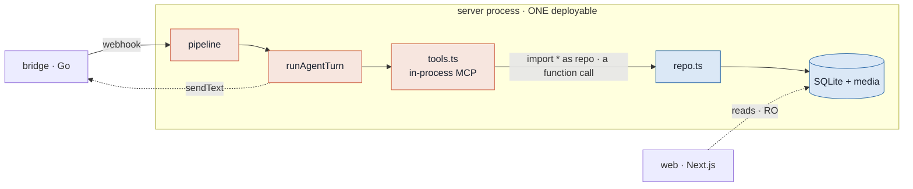
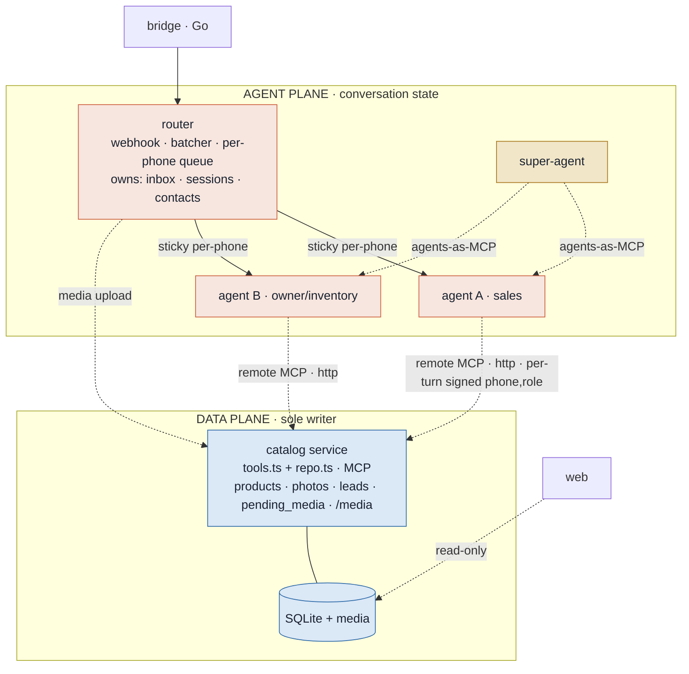
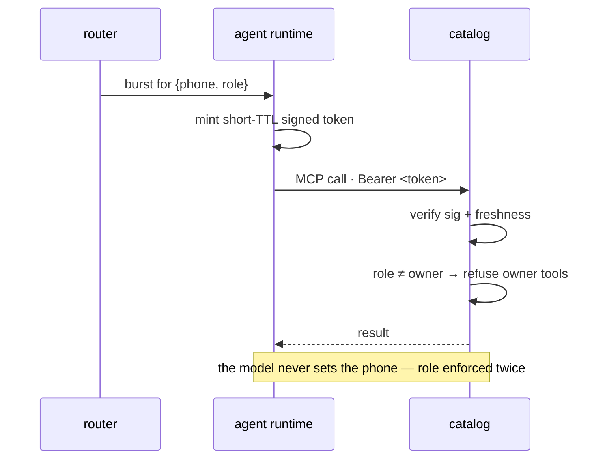
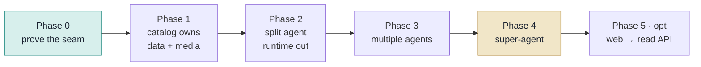

# Decoupling the Agent from the Catalog

**Why:** today the agent and the catalog are one process. We want them to grow apart — evolve the catalog independently, run **multiple agents**, and add a **super-agent** that orchestrates them.

**The starting advantage** — the codebase is already seamed for this:

- The agent's tools are **already an MCP server** (`buildToolServer` → `createSdkMcpServer`).
- All catalog access **already funnels through `repo.ts`** — no raw SQL in the agent.

So decoupling is **promoting in-process seams to network seams**, not a rewrite. The Agent SDK's `mcpServers` accepts a remote `{ type:"http", url, headers }` server with the same `allowedTools` / `canUseTool` guards — including a **per-turn `Authorization` header**, which is what keeps identity trustworthy across the network.

## Today — one process, joined by a function call

The red (agent) and blue (catalog) concerns share one process, bound by a **function call** and a shared `ctx.phone` closure. That closure *is* the security model: owner-gating trusts the phone because the model can never set it.

## Target — two planes, one seam

The one edge that changes everything: `tools.ts` stops calling `repo.ts` by import and calls the catalog **over HTTP MCP**. Every other pattern survives. Add agents by adding boxes on the top plane; the super-agent's tools are the other agents.

## The crux — identity across the wire

`ctx.phone` was safe as a server closure; over a network it must not be trusted from the payload. Reuse the HMAC discipline the code already lives by (bridge webhook signature, mirrored anon-token).

## Who owns which table

| Data plane · catalog | Agent plane · router |
|---|---|
| `products` | `sessions` |
| `product_photos` | `inbox` |
| `product_changes` | `contacts` |
| `leads` | |
| **`pending_media`** ← | |

**`pending_media` stays with the catalog:** `attachPendingPhotos` moves rows `pending_media → product_photos` in **one transaction**, and photo order (first = cover) is load-bearing. Splitting them turns an atomic move into a distributed saga. Consequence: inbound owner photos, which arrive on the agent plane, get **uploaded to the catalog over the wire** instead of via a shared volume.

## Phasing — incremental, no big-bang

| Phase | Ships | Value |
|---|---|---|
| **0 · Prove the seam** | Catalog runs as standalone HTTP-MCP wrapping today's `tools.ts`+`repo.ts` verbatim; one agent points `mcpServers` at it with a signed `{phone,role}` header; in-process path stays behind a flag. | Smallest reversible change that makes "agent talks to catalog over the network" true. |
| **1 · Catalog owns data** | Move `pending_media` + media ingest/serve in; authenticated photo upload; catalog is sole writer. | Data plane self-contained. |
| **2 · Split agent runtime** | Router owns inbox/sessions/contacts and forwards bursts to a separate agent runtime; role→persona routing lives here. | Agent is its own deployable. |
| **3 · Multiple agents** | N runtimes, each its own persona/toolset, all on one catalog MCP; phone→agent sticky routing. | The "more agents" goal. |
| **4 · Super-agent** | A runtime whose tools are the other agents' endpoints; queries and orchestrates. | The "orchestrator" goal. |
| **5 · Web → read API** (opt) | Replace web's direct SQLite reads with a catalog read API. | Removes the last shared-file assumption. |

**Minimal first step = Phase 0** — the whole thesis in one reversible change.

## Risks & mitigations

| Risk | Sev | Mitigation |
|---|---|---|
| Phone trust across the wire | **High** | Per-turn short-TTL signed `{phone,role}` in the MCP header; catalog verifies + re-checks role. Pinning tests, as today. |
| Per-phone serialization with many agents | **High** | Keep serialization in the single router; route phone→agent **sticky**. `claimInboxBatch` atomicity stays in one place. |
| Session / transcript ownership | Med | Partition `sessions` + transcript volume per runtime; sticky routing makes a session resumable only where its transcript lives. |
| Sole-writer vs web's direct read | Med | Catalog owns `createSchema`; web keeps read-only SELECTs on the co-located volume until Phase 5. |
| `pending_media → photos` atomicity | Low | Keep both tables in the catalog — never split them. |
| Media handoff off the shared volume | Med | Router uploads bytes to catalog (one photo per POST preserves cover order); catalog owns `/media`. |
| Per-turn MCP handshake latency | Med | SDK caches the tool list; keep catalog warm/internal; tune `MCP_TIMEOUT`. **Measure in Phase 0.** |
| Inter-service auth | Low | Per-service bearer tokens (already done: `BRIDGE_API_TOKEN`). New `CATALOG_URL`/`CATALOG_TOKEN` fit the existing config pattern. |

## Files this touches when we build

`agent/tools.ts` (becomes the catalog MCP) · `agent/agent.ts` (remote-MCP + token minting) · `data/repo.ts` & `data/db.ts` (catalog boundary + schema split) · `index.ts` (process boundaries) · `config.ts` (new URLs/tokens).

---

*See also: [`agent-roles-routing.md`](./agent-roles-routing.md) — the role model that sits on top of this decoupling.*
