# Decoupling the Agent into a Platform

**Goal:** one runtime that can host N agents. Each agent is **data** (a definition: behaviour, knowledge, tool set), the runtime is **code**, and a request reaches an agent through one inbox whether it comes from a WhatsApp user or from another agent. Planning only — nothing here is implemented.

**Supersedes** [agent-catalog-decoupling.md](agent-catalog-decoupling.md), which was written ten days before the Shopify migration and describes a `repo.ts` catalog that no longer exists. **Complements** [agent-roles-routing.md](agent-roles-routing.md), which decides *who* reaches *which* agent; this page decides what an agent *is* and how a message gets in and out.

---

## 1. AS IS — one process, one agent, two personas

### 1.1 What depends on what

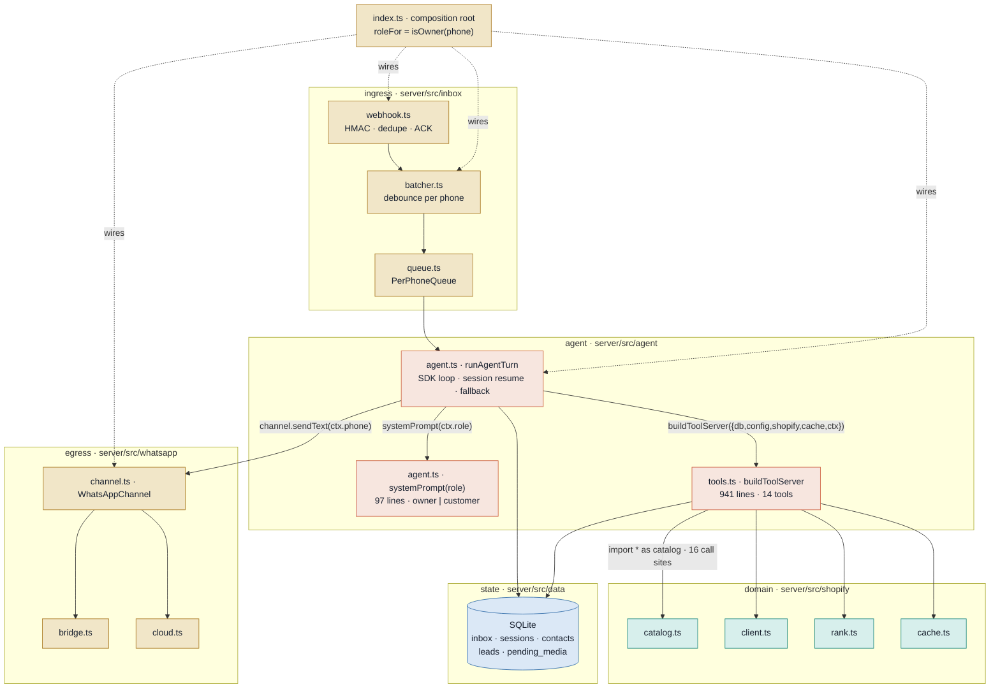

| Arrow | Anchor | Why it is coupling |
|---|---|---|
| runtime → prompt | `server/src/agent/agent.ts:340` | Prompt is a function in the same file, selected by a two-value `Role` |
| runtime → tools | `server/src/agent/agent.ts:324` | Runtime knows the Shopify client and cache only to hand them to tools |
| runtime → WhatsApp | `server/src/agent/agent.ts:554` | The turn **sends** the reply itself; the caller cannot route it elsewhere |
| tools → Shopify | `server/src/agent/tools.ts:5` | Direct imports; the tool set *is* the Shopify adapter |
| prompt ↔ tools | `server/src/agent/agent.ts:47` | Eleven tool names as string literals; nothing checks they exist |
| identity | `server/src/types.ts:74` | `TurnContext.phone` is the session key, the reply address and the role source |
| role | `server/src/config.ts:430` | `isOwner(phone)` — one env allowlist, two roles, no third |

### 1.2 One message today

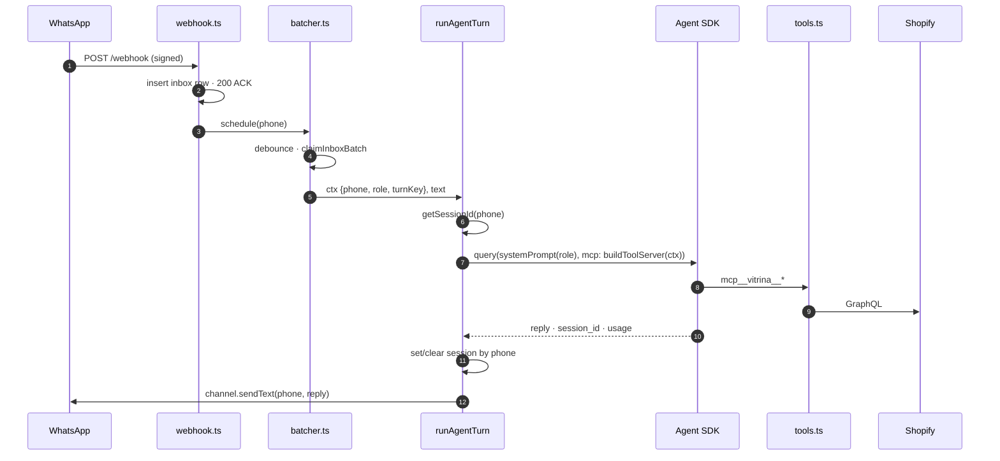

### 1.3 Where each concern lives today

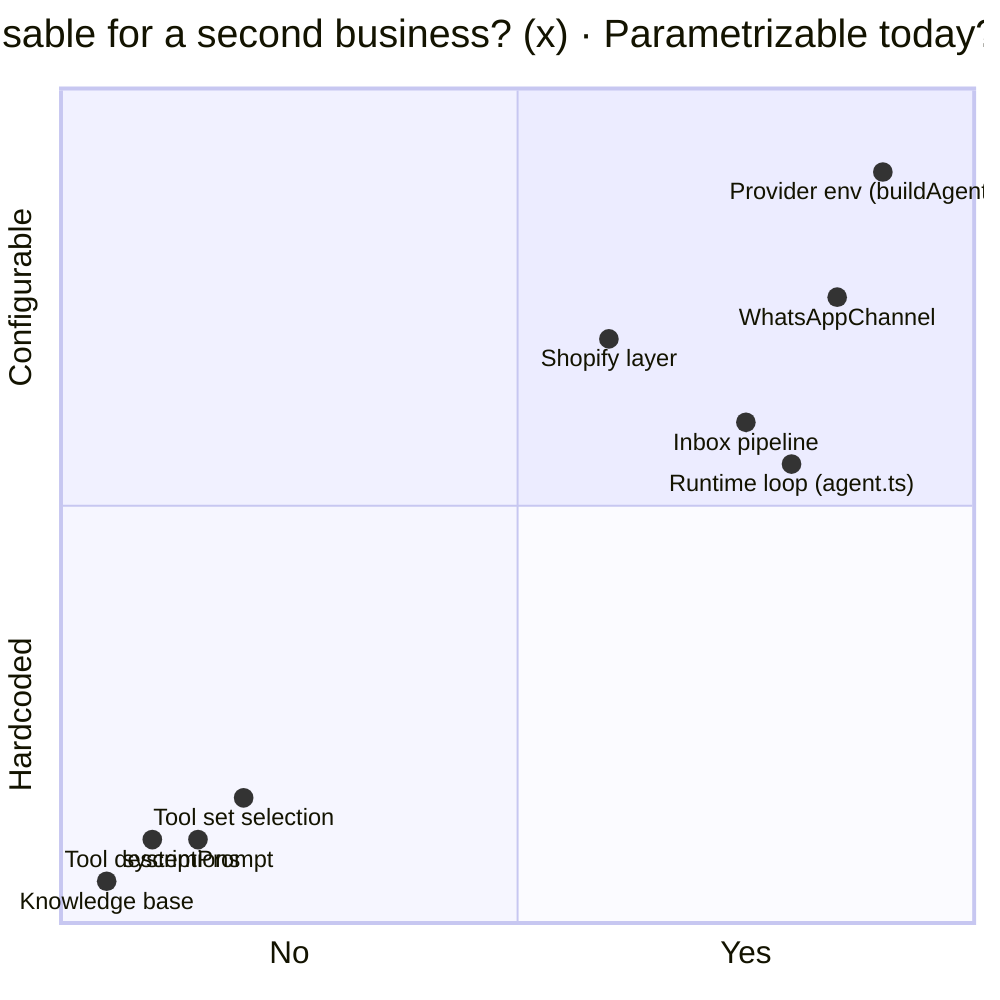

> ⚠️ There is **no knowledge base** today. Business facts the model needs (an example SKU, the option axes, what "publicar" means) live inside tool descriptions and the prompt. `server/src/agent/tools.ts:499`, `server/src/agent/agent.ts:89`

---

## 2. TO BE — one runtime, N agent definitions, one inbox

### 2.1 The shape

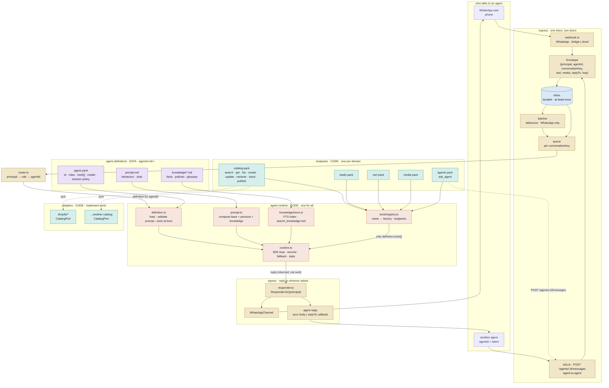

**Legend** — purple = data, edited per business without a deploy · red = the one runtime · green = code that knows a domain · yellow = transport and routing · dashed = port, swappable.

### 2.2 What an agent definition is

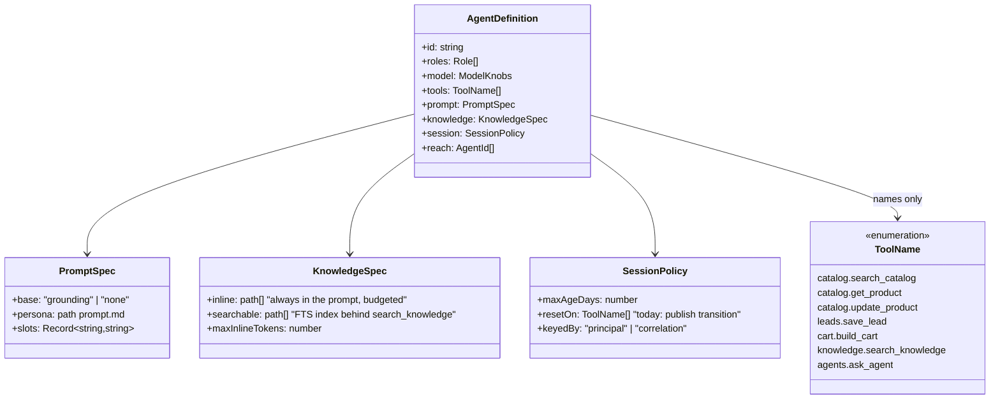

| Today | Becomes | Today's anchor |
|---|---|---|
| `systemPrompt(role)` switch | `agents/vitrina-ventas/prompt.md` + `agents/vitrina-inventario/prompt.md` | `server/src/agent/agent.ts:31` |
| `customerTools` / `ownerTools` arrays | `tools: [...]` list in each `agent.yaml` | `server/src/agent/tools.ts:455` |
| `get_product` with two closures by role | Two tools: `catalog.get_product` and `catalog.get_product_any_status`; the definition picks one | `server/src/agent/tools.ts:348` |
| Example SKUs, axes, confirmation phrasing inside descriptions | `knowledge/` docs + `slots` rendered into generic descriptions | `server/src/agent/tools.ts:499` |
| `sessionAfterTurn = "reset"` set inside a tool | `session.resetOn` declared; runtime watches the tool stream it already reads | `server/src/agent/agent.ts:531` |
| `isOwner(phone)` | `router.ts`: assignment table `phone → role`, definition `roles` says which agent | `server/src/config.ts:430` |

> ℹ️ The boot validator is the piece that closes today's silent hole: every tool name the prompt mentions must be in `definition.tools`, and every name in `definition.tools` must exist in the registry. A typo fails startup instead of producing an agent that asks for a tool it does not have.

### 2.3 The tool layer: registry, packs, ports

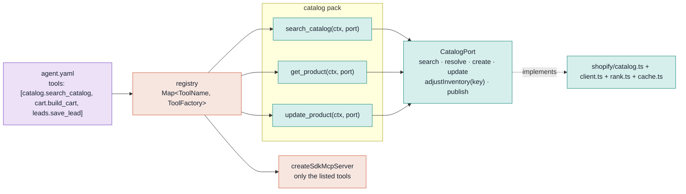

| Rule | Keeps |
|---|---|
| A factory receives `(ctx, ports)` and returns one SDK tool | `tools.test.ts` prefix pin becomes "the served set equals `definition.tools`" |
| `turnKey` + per-turn counter travel in `ctx` into the port | Stock idempotency, unchanged `server/src/agent/tools.ts:282` |
| Descriptions are English templates with `{{slots}}`; business literals come from the definition | Same prompt quality, no SKU baked into code |
| `shopify/` stays as it is and gains one `implements CatalogPort` file | Zero rewrite of the layer that already works |

### 2.4 Knowledge base

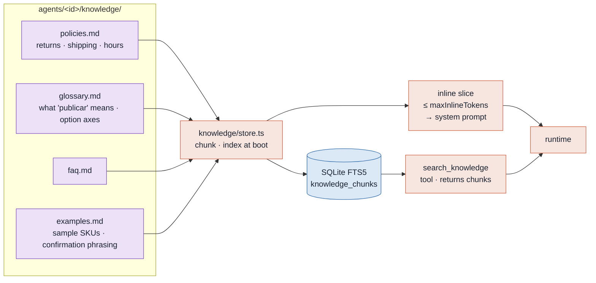

> ℹ️ Two tiers on purpose. Short, always-relevant facts go **inline** so a resumed transcript still carries them. Long material goes behind a **tool**, so the grounding rule holds: the agent states what a tool returned. No vector store in phase 1; FTS5 is already in the SQLite build we ship.

### 2.5 One WhatsApp message, to be

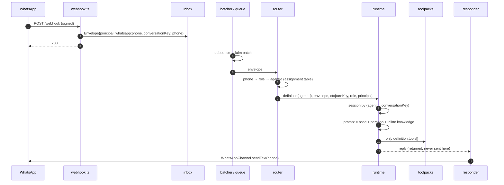

### 2.6 One agent asking another, to be

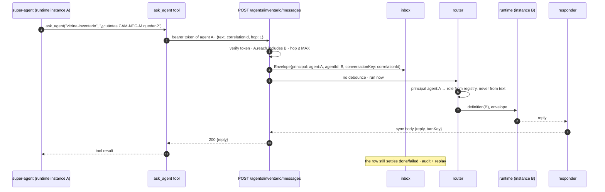

| Decision | Choice | Why |
|---|---|---|
| Sync or async reply to an agent | **Sync body** by default; `replyTo` callback when the caller sets it | A tool call is already a request-response; a callback is one more thing to lose |
| Loop guard | `hop` counter in the envelope, cap 3; an agent never reaches itself | A super-agent asking an agent that asks the super-agent is otherwise a bill |
| Who says the caller's role | The **agent registry**, from the bearer token | Same rule as WhatsApp: identity from the transport, never from the message |
| Debounce | None for agent principals | Bursts are a human behaviour; an agent sends one complete message |
| Durability | Still through `inbox` | One retry story, one replay story, one place to audit |

### 2.7 Data model changes

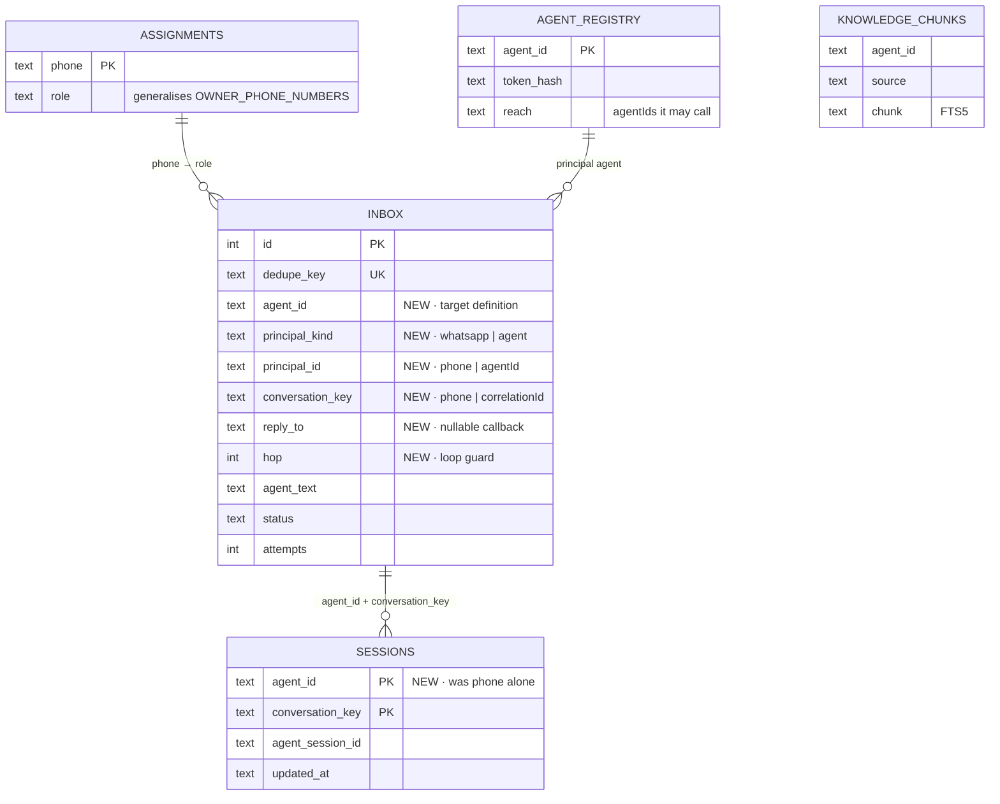

> ⚠️ `sessions` is keyed by `phone` today (`server/src/data/db.ts:49`) and `CREATE TABLE IF NOT EXISTS` never alters an existing table. The key change needs a real migration step, not a DDL edit.

### 2.8 Where files land

```text
server/src/
  agent/
    runtime.ts        ← agent.ts minus systemPrompt minus sendText; knows no domain
    definition.ts     ← load agents/<id>/agent.yaml · validate prompt↔tools↔registry
    prompt.ts         ← compose base + persona + inline knowledge + slots
  knowledge/
    store.ts          ← chunk, index (FTS5), budgeted inline slice
    tool.ts           ← search_knowledge
  tools/
    registry.ts       ← Map<ToolName, ToolFactory>
    ports.ts          ← CatalogPort, LeadsPort, MediaPort
    packs/catalog.ts  ← today's tools.ts, split; descriptions templated
    packs/leads.ts · packs/cart.ts · packs/media.ts · packs/agents.ts
  shopify/            ← unchanged, plus catalog-port.ts (implements CatalogPort)
  inbox/
    envelope.ts       ← Envelope, Principal
    webhook.ts        ← WhatsApp door (as today)
    a2a.ts            ← agent door
    batcher.ts · queue.ts  ← keyed by conversationKey
  egress/
    responder.ts      ← Responder.for(principal): WhatsApp | agent
  router.ts           ← principal → role → agentId
agents/
  vitrina-ventas/       agent.yaml · prompt.md · knowledge/
  vitrina-inventario/   agent.yaml · prompt.md · knowledge/
```

---

## 3. Migration — six phases, each shippable

```mermaid
flowchart LR
  P0["0 · docs<br/>mark old plan superseded"]
  P1["1 · runtime seam<br/>reply returned, not sent<br/>Envelope + Principal<br/>sessions by agentId+key"]
  P2["2 · definitions<br/>two agent.yaml + prompt.md<br/>boot validator"]
  P3["3 · tool registry<br/>packs · ports · templated descriptions"]
  P4["4 · knowledge base<br/>inline + FTS + search_knowledge"]
  P5["5 · agent door<br/>a2a.ts · registry · ask_agent · hop guard"]
  P6["6 · router table<br/>assignments replace OWNER_PHONE_NUMBERS"]
  P0 --> P1 --> P2 --> P3 --> P4 --> P5 --> P6

  classDef io fill:#f1e6c8,stroke:#a9781f,color:#1a2230;
  classDef agent fill:#f7e6df,stroke:#cd5f40,color:#1a2230;
  classDef defs fill:#ece1f7,stroke:#7d4bc0,color:#1a2230;
  classDef domain fill:#d7efec,stroke:#1f8a80,color:#1a2230;
  class P0,P1,P5,P6 io;
  class P2,P4 defs;
  class P3 domain;
```

| Phase | Behaviour change for today's users | Tests that pin it |
|---|---|---|
| 1 | None. Owner and customer map to two definitions with today's exact prompts | `agent.test.ts` persona pins move to the two `prompt.md` files; new: `runAgentTurn` returns and does not send |
| 2 | None | New: boot fails on a prompt naming a tool outside `definition.tools` |
| 3 | None | `tools.test.ts` prefix pin becomes a set-equality pin per definition; Shopify call recordings unchanged |
| 4 | Owner answers "¿qué significa publicar?" from knowledge instead of the prompt | New: inline budget respected; `search_knowledge` returns chunks only from its agent |
| 5 | New endpoint, off by default until a registry row exists | New: unknown token 401 · reach violation 403 · hop 4 refused · role never read from text |
| 6 | `OWNER_PHONE_NUMBERS` still honoured as seed rows | `config.test.ts` empty-allowlist refusal in the purge tool stays |

### 3.1 Invariants that survive every phase

| Invariant | Where it lives after |
|---|---|
| `turnKey` from the FIRST inbox row · per-turn counter | `Envelope.turnKey`, minted in the batcher as today `server/src/types.ts:88` |
| Role from the transport, never from the text | `router.ts` for phones; `a2a.ts` token for agents |
| `tools: []` removes built-ins; `allowedTools` only approves | `runtime.ts`, verbatim `server/src/agent/agent.ts:352` |
| One turn at a time per conversation | `PerPhoneQueue` renamed to per-conversation, same class `server/src/inbox/queue.ts:9` |
| A turn without words still answers | `NO_ANSWER_FALLBACK` in `runtime.ts`; the responder sends it |
| Reset session on publish | `session.resetOn` in the definition; runtime reads the tool stream it already parses `server/src/agent/agent.ts:390` |
| ECHO_MODE ahead of both gates | Unchanged in `index.ts` |
| At-least-once with capped attempts | `inbox.attempts`, unchanged; agent-door rows follow the same path |

---

## 4. What this does NOT do

| Out of scope | Reason |
|---|---|
| Split into separate processes | The seams above are in-process; promoting one to HTTP is a later, independent step |
| Vector search | FTS5 covers policies and glossaries; revisit when a knowledge folder exceeds what keyword search serves |
| A second catalog adapter | `CatalogPort` is defined so one *can* exist; writing it is another business's work |
| The super-agent's own logic | [agent-roles-routing.md](agent-roles-routing.md) owns that; this page only gives it a door and a tool |
