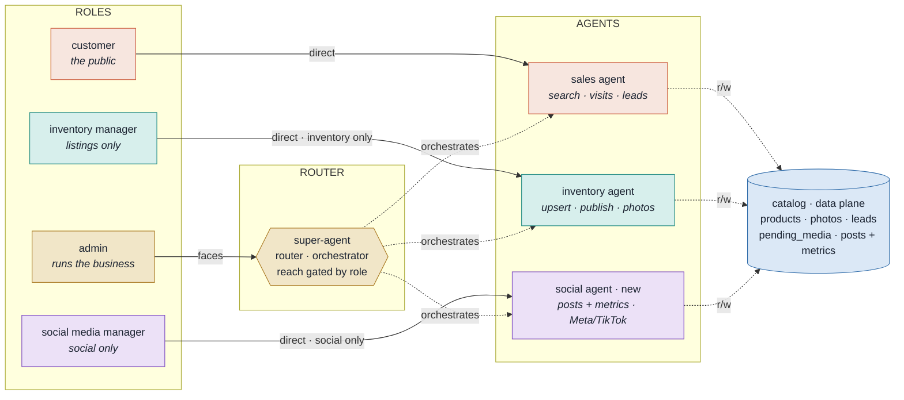

# Agent Roles & Routing

The **super-agent is a router**, not a wall in front of everything. Each specialist agent has an optional **direct single-domain role**; **admin** is the one role that goes through the super-agent and can chain agents. Every arrow is **set by data** (a config row), so the set grows without a deploy.

## Routing

**Legend** — solid = direct path (role → its one agent) · dashed = super-agent orchestrates · dashed to catalog = reads/writes.

Follow the color from a role to its agent. Customer, inventory manager, and social media manager each reach exactly one specialist directly — no orchestration tax, and a hard ceiling on what they can touch. Admin speaks to the super-agent, which is wired to all three agents and chains them when a request spans domains.

## Roles

| Role | Faces | Can reach | Purpose |
|---|---|---|---|
| **customer** | sales agent · direct | sales | Find properties, schedule visits. Existing public path, unchanged. |
| **inventory manager** | inventory agent · direct | inventory only | Add / edit / publish listings — nothing else. |
| **social media manager** | social agent · direct | social only | Create posts for Meta / TikTok and review metrics — nothing else. |
| **admin** | super-agent | all agents + orchestration | Run the business + complex cross-agent tasks, e.g. *"which listings got the most IG engagement this week, and are they still active?"* |

## Dynamic by design

The "direct manager" is a **repeatable template**: every specialist agent can have a single-domain role that talks only to it. Add a fourth agent → its manager role is one more row, and admin's reach extends to it automatically. Two tables hold the whole model:

- **Capability matrix** — `role → { faces, reachable agents }`. The super-agent enforces the reachable set at call time; widening/narrowing a role is a row edit, never code.
- **Assignment table** — `phone → role`. Generalizes today's `OWNER_PHONE_NUMBERS` into named roles. Role still comes from the number, never from what the person claims.

## Confirmed

- Admin faces the super-agent and reaches everything — the single orchestrating role (owner folded in).
- Customer, inventory manager, and social media manager each stay direct to their one agent.
- The two "manager" roles are strictly single-domain; social media manager is newly added.

---

*Next: the technical layer — how the super-agent invokes agents (agent-as-tool over MCP), how the per-turn signed `{phone, role}` gates reach, and where the capability matrix + phone→role table live.*
