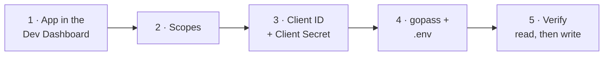

# Connecting Vitrina to a Shopify store



> ⚠️ **This page changed in August 2026.** Shopify no longer lets anyone create
> admin-created custom apps: *"You can no longer create new admin-created custom apps.
> Existing apps are unaffected and continue to work. For new apps, use Dev Dashboard or
> Shopify CLI."* The old **Settings → Apps → Develop apps** path only appears for apps made
> before January 2026, and it is the path this page used to describe.

Credentials here can read and rewrite the whole catalog. Treat them like a database
password.

## 1 · Create the app in the Dev Dashboard

| Step | Where |
|---|---|
| Open | `https://dev.shopify.com/dashboard/` → your organization |
| Navigate | **Apps** → **Create app** (top right) |
| Choose | **Start from Dev Dashboard** |
| Create | Name it `Vitrina` → **Create** |

> ⚠️ The app and the store must be in the **same Shopify organization**. This is what the
> client credentials grant checks, and a store outside it answers `shop_not_permitted` —
> a message that never mentions organizations. `server/src/shopify/client.ts:66`

## 2 · Grant exactly these scopes

Scopes belong to an app VERSION, not to the app. Open the **Versions** tab and create one,
declaring exactly these:

| Scope | Needed for |
|---|---|
| `read_products` | Search, `get_product`, `list_products` |
| `write_products` | `create_product`, `update_product`, `delete_product`, attaching media |
| `read_inventory` | `get_inventory` |
| `write_inventory` | `adjust_inventory` (both `set_to` and `delta`) |
| `read_locations` | Resolving which location a count belongs to |
| `read_publications` | Finding the Online Store publication |
| `write_publications` | Actually publishing a product to it |
| `write_files` | Uploading the owner's photos |

> ⚠️ The last three are the ones people miss, and **both failures look like a network
> hiccup, not a permissions error.** Without the publications pair the owner is told the
> product is ACTIVE but not visible; without `write_files` every photo lands in `failed`.

> ℹ️ Grant nothing else. No `read_orders`, no `read_customers`, no `write_price_rules`.
> Milestone 1 has no checkout, so the token has no business touching money or people.

Then **Release** the version. This is not optional bookkeeping: the token endpoint hands out
whatever the RELEASED version declares, so a saved-but-unreleased scope change simply does not
exist as far as the credentials are concerned. Do **not** touch the Storefront API section;
Vitrina uses the Admin API only.

> ⚠️ Changing scopes later means creating and releasing a NEW version. Shopify does not apply
> a scope change to an existing release.

## 3 · Copy the client credentials

**Settings** in your app → **Client ID** and **Client secret**.

> ℹ️ There is no `shpat_` token to copy any more. The server exchanges these two for an
> access token at runtime and renews it before it expires — which is the whole reason these
> are what lives in the environment: **the token lasts 24 hours, these do not expire.**
> `server/src/shopify/client.ts:177`

```bash
gopass insert -f vitrina/shopify_client_secret
```

The client id is not a secret and can sit in `.env`; the secret mints new tokens on demand,
so it belongs in gopass with the rest.

## 4 · Wire it up

The token is a secret and lives in gopass. The domain is not, and lives in `.env`.

```bash
# .env at the repo root — no scheme, no trailing slash (both are stripped anyway)
SHOPIFY_STORE_DOMAIN=your-store.myshopify.com
SHOPIFY_API_VERSION=2026-01
SHOPIFY_LOCATION_ID=
```

| Variable | Source | Required |
|---|---|---|
| `SHOPIFY_STORE_DOMAIN` | `.env` | Yes — the server refuses to boot without it |
| `SHOPIFY_CLIENT_ID` | `.env` | Yes, unless a legacy `SHOPIFY_ADMIN_TOKEN` is set |
| `SHOPIFY_CLIENT_SECRET` | gopass `vitrina/shopify_client_secret` | Same |
| `SHOPIFY_ADMIN_TOKEN` | gopass, legacy apps only | Only without the pair above |
| `SHOPIFY_API_VERSION` | `.env`, defaults to `2026-01` | No |
| `SHOPIFY_LOCATION_ID` | `.env` | Only with more than one location |

> ⚠️ Every `docker compose up`/`run` must go through `./scripts/with-secrets.sh` — it is
> what injects the token. `compose.yaml` interpolates it with no default, so a bare `up`
> boots a server whose every product tool fails.

## 5 · Verify, read before write

```bash
export SHOPIFY_STORE_DOMAIN=your-store.myshopify.com

# Mint a token the same way the server does: one POST, form-encoded, no OAuth
# redirect. The reply carries expires_in: 86399 — that is where 24 hours comes from.
export SHOPIFY_ADMIN_TOKEN="$(curl -s -X POST \
  "https://$SHOPIFY_STORE_DOMAIN/admin/oauth/access_token" \
  -d grant_type=client_credentials \
  -d "client_id=$SHOPIFY_CLIENT_ID" \
  -d "client_secret=$(gopass show -o vitrina/shopify_client_secret)" \
  | python3 -c 'import json,sys; print(json.load(sys.stdin)["access_token"])')"

curl -s "https://$SHOPIFY_STORE_DOMAIN/admin/api/2026-01/graphql.json" \
  -H "X-Shopify-Access-Token: $SHOPIFY_ADMIN_TOKEN" \
  -H 'Content-Type: application/json' \
  -d '{"query":"{ shop { name } locations(first:5){nodes{id name}} publications(first:10){nodes{id name}} }"}'
```

| What comes back | Means |
|---|---|
| `shop.name` | Domain and token are both right |
| `locations.nodes` | If more than one, put the right gid in `SHOPIFY_LOCATION_ID` |
| a publication named `Online Store` | `read_publications` is granted. Note it exists |
| `"Access denied"` on `publications` | You skipped `read_publications`. Go back to step 2 |
| HTTP 401 | Wrong token, or the app was never installed |
| HTTP 404 | Wrong domain, or an API version this store no longer serves |

> ⚠️ A missing scope answers **200 with an `errors` array**, not 401. Read the body, not
> the status code — the same trap the client handles at `server/src/shopify/client.ts:140`.

Then, and only then, boot the server and try it over WhatsApp — read first
("¿qué tengo?"), then one harmless write on a throwaway DRAFT product.

## Keeping the version current

`SHOPIFY_API_VERSION` is pinned on purpose: an unpinned version is an agent that changes
behaviour without a deploy. Each stable version is supported for at least 12 months, so
`2026-01` needs a bump before January 2027.

> ℹ️ Confirm the current stable version on shopify.dev rather than trusting a number
> written down anywhere, including here. As of August 2026 the latest stable is `2026-07`
> and `2026-01` is served until 16 January 2027.

> ⚠️ From **2026-04** the `@idempotent` key on `inventoryAdjustQuantities` stops being
> optional and becomes **required**. `adjustInventory` already sends one on every call, so
> moving the pin forward is safe. `server/src/shopify/catalog.ts:384`

## If something breaks

| Symptom | Cause |
|---|---|
| Server exits at boot: `Missing Shopify credential` | No `SHOPIFY_CLIENT_ID`+`SHOPIFY_CLIENT_SECRET` and no `SHOPIFY_ADMIN_TOKEN` — usually a command that skipped `with-secrets.sh` |
| `the app and the store are not in the same Shopify organization` | `shop_not_permitted` from the token endpoint. Move the store into the org, or create it under **Dev stores** |
| `SHOPIFY_CLIENT_ID or SHOPIFY_CLIENT_SECRET is wrong` | `invalid_client`. Re-copy both from the app's Settings |
| Everything worked yesterday and fails today | Would be an unrenewed 24h token — but the client renews five minutes early and retries once on a 401, so this should be impossible. Check the logs for a token-mint failure |
| "status is ACTIVE but it could not be published" | Missing `read_publications` / `write_publications` |
| "N failed and are still pending" on every photo | Missing `write_files` |
| "Shopify throttled the request" after 4 attempts | Real rate limiting; the client already backs off |
| "The store has more than one location and none was given" | Set `SHOPIFY_LOCATION_ID` |

**[← Home](README.md)** · **[Secrets](secrets-management.md)** · **[Deployment](01-arquitectura/despliegue.md)**
