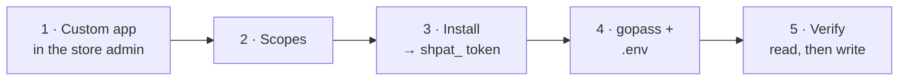

# Connecting Vitrina to a Shopify store



You need the store owner's Shopify login and the **Store owner** role (or a staff account
with the *Develop apps* permission). The token this produces can read and rewrite the
whole catalog, so treat it like a database password.

## 1 · Create the custom app

| Step | Where |
|---|---|
| Log in | `https://admin.shopify.com/store/<your-store>` |
| Navigate | **Settings → Apps and sales channels → Develop apps** |
| First time only | Click **Allow custom app development** and confirm |
| Create | **Create an app** → name it `Vitrina` → **Create app** |

> ℹ️ A custom app is per-store and never goes through the App Store. It exists only to
> mint an Admin API token.

## 2 · Grant exactly these scopes

**Configuration → Admin API integration → Configure**, then tick:

| Scope | Needed for |
|---|---|
| `read_products` | Search, `get_product`, `list_products` |
| `write_products` | `create_product`, `update_product`, `delete_product`, attaching media |
| `read_inventory` | `get_inventory` |
| `write_inventory` | `adjust_inventory` (both `set_to` and `delta`) |
| `read_locations` | Resolving which location a count belongs to |
| `read_publications` | Finding the Online Store publication |
| `write_publications` | Actually publishing a product to it |
| `write_files` | Uploading the owner's photos |

> ⚠️ The last three are the ones people miss, and **both failures look like a network
> hiccup, not a permissions error.** Without the publications pair the owner is told the
> product is ACTIVE but not visible; without `write_files` every photo lands in `failed`.

> ℹ️ Grant nothing else. No `read_orders`, no `read_customers`, no `write_price_rules`.
> Milestone 1 has no checkout, so the token has no business touching money or people.

Save. Do **not** touch the Storefront API section — Vitrina uses the Admin API only.

## 3 · Install and copy the token

**API credentials → Install app → Install**. Shopify reveals the Admin API access token
(`shpat_…`) **once**.

> ⚠️ Copy it straight into gopass. If you lose it you cannot re-read it — you have to
> uninstall and reinstall the app, which mints a different token.

```bash
gopass insert -f vitrina/shopify_admin_token
```

Changing scopes later means clicking **Save**, then reinstalling; the token survives a
scope change, so nothing else has to move.

## 4 · Wire it up

The token is a secret and lives in gopass. The domain is not, and lives in `.env`.

```bash
# .env at the repo root — no scheme, no trailing slash (both are stripped anyway)
SHOPIFY_STORE_DOMAIN=your-store.myshopify.com
SHOPIFY_API_VERSION=2026-01
SHOPIFY_LOCATION_ID=
```

| Variable | Source | Required |
|---|---|---|
| `SHOPIFY_STORE_DOMAIN` | `.env` | Yes — the server refuses to boot without it |
| `SHOPIFY_ADMIN_TOKEN` | gopass `vitrina/shopify_admin_token` | Yes |
| `SHOPIFY_API_VERSION` | `.env`, defaults to `2026-01` | No |
| `SHOPIFY_LOCATION_ID` | `.env` | Only with more than one location |

> ⚠️ Every `docker compose up`/`run` must go through `./scripts/with-secrets.sh` — it is
> what injects the token. `compose.yaml` interpolates it with no default, so a bare `up`
> boots a server whose every product tool fails.

## 5 · Verify, read before write

```bash
export SHOPIFY_STORE_DOMAIN=your-store.myshopify.com
export SHOPIFY_ADMIN_TOKEN="$(gopass show -o vitrina/shopify_admin_token)"

curl -s "https://$SHOPIFY_STORE_DOMAIN/admin/api/2026-01/graphql.json" \
  -H "X-Shopify-Access-Token: $SHOPIFY_ADMIN_TOKEN" \
  -H 'Content-Type: application/json' \
  -d '{"query":"{ shop { name } locations(first:5){nodes{id name}} publications(first:10){nodes{id name}} }"}'
```

| What comes back | Means |
|---|---|
| `shop.name` | Domain and token are both right |
| `locations.nodes` | If more than one, put the right gid in `SHOPIFY_LOCATION_ID` |
| a publication named `Online Store` | `read_publications` is granted. Note it exists |
| `"Access denied"` on `publications` | You skipped `read_publications`. Go back to step 2 |
| HTTP 401 | Wrong token, or the app was never installed |
| HTTP 404 | Wrong domain, or an API version this store no longer serves |

> ⚠️ A missing scope answers **200 with an `errors` array**, not 401. Read the body, not
> the status code — the same trap the client handles at `server/src/shopify/client.ts:140`.

Then, and only then, boot the server and try it over WhatsApp — read first
("¿qué tengo?"), then one harmless write on a throwaway DRAFT product.

## Keeping the version current

`SHOPIFY_API_VERSION` is pinned on purpose: an unpinned version is an agent that changes
behaviour without a deploy. Each stable version is supported for at least 12 months, so
`2026-01` needs a bump before January 2027.

> ℹ️ Confirm the current stable version in the admin's API credentials page rather than
> trusting a number written down anywhere, including here.

> ⚠️ From **2026-04** the `@idempotent` key on `inventoryAdjustQuantities` stops being
> optional and becomes **required**. `adjustInventory` already sends one on every call, so
> moving the pin forward is safe. `server/src/shopify/catalog.ts:384`

## If something breaks

| Symptom | Cause |
|---|---|
| Server exits at boot: `Missing required environment variable: SHOPIFY_ADMIN_TOKEN` | The command did not go through `with-secrets.sh` |
| "status is ACTIVE but it could not be published" | Missing `read_publications` / `write_publications` |
| "N failed and are still pending" on every photo | Missing `write_files` |
| "Shopify throttled the request" after 4 attempts | Real rate limiting; the client already backs off |
| "The store has more than one location and none was given" | Set `SHOPIFY_LOCATION_ID` |

**[← Home](README.md)** · **[Secrets](secrets-management.md)** · **[Deployment](01-arquitectura/despliegue.md)**
